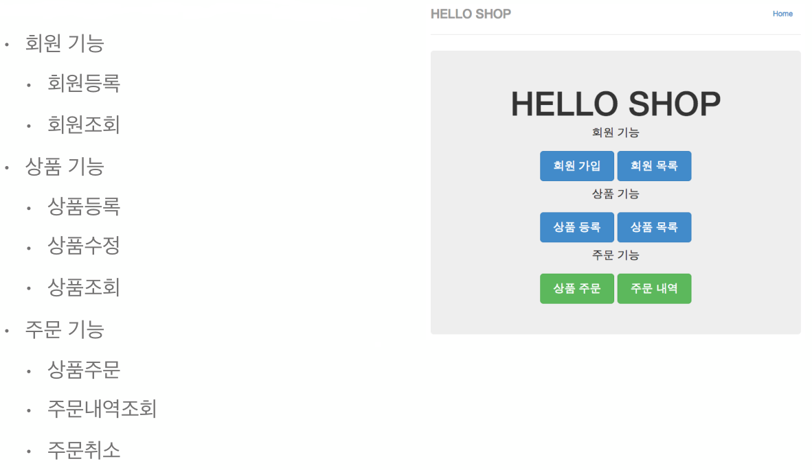
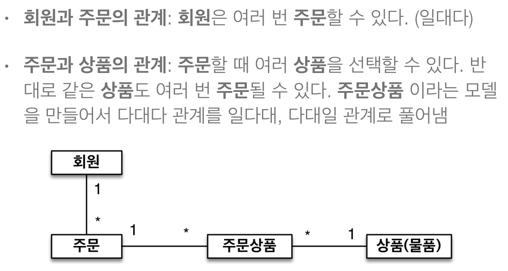
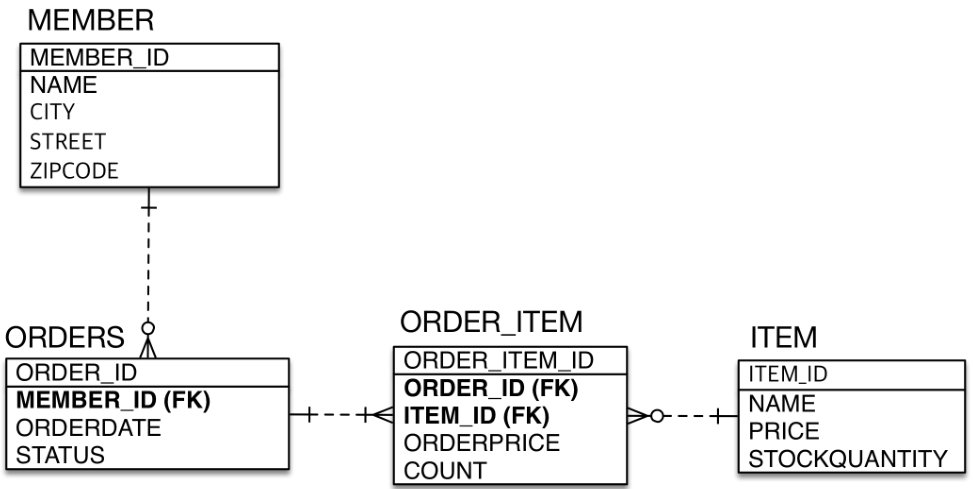
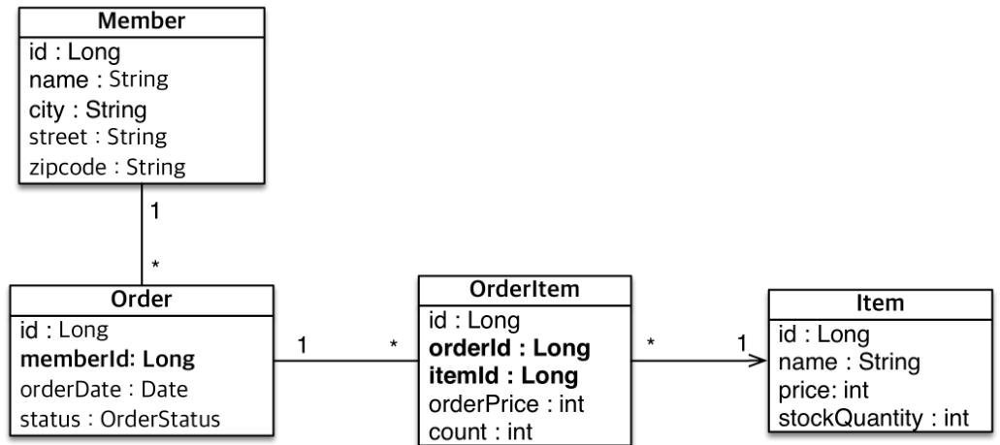

# 4. 실전예제1 - 요구사항 분석과 매핑

## 요구사항 분석


## 기능 목록


## 도메인 모델 분석


## 테이블 설계


## 엔티티 설계와 매핑


## 데이터 중심 설계의 문제점
- 현재 방식은 객체 설계를 테이블 설계에 맞춘 방식 
- 테이블의 외래키를 객체에 그대로 가져옴
- 객체 그래프 탐색이 불가능
- 참조가 없으므로 UML도 잘못됨

## 엔티티 매핑 코드
- 멤버 엔티티
```java
@Entity
public class Member {
    @Id
    @GeneratedValue
    @Column(name = "MEMBER_ID")
    private Long id;
    private String name;
    private String city;
    private String street;
    private String zipcode;
    
    public Member() {}

    public Long getId() {
        return id;
    }

    public void setId(Long id) {
        this.id = id;
    }

    public String getName() {
        return name;
    }

    public void setName(String name) {
        this.name = name;
    }

    public String getCity() {
        return city;
    }

    public void setCity(String city) {
        this.city = city;
    }

    public String getStreet() {
        return street;
    }

    public void setStreet(String street) {
        this.street = street;
    }

    public String getZipcode() {
        return zipcode;
    }

    public void setZipcode(String zipcode) {
        this.zipcode = zipcode;
    }
}
```
- 주문 엔티티
```java
@Entity
@Table(name = "ORDERS") //데이터베이스에서 ORDER가 예약어로 걸려있으므로 방지를 위함
public class Order {
    
    @Id
    @GeneratedValue
    @Column(name = "ORDER_ID")
    private Long id;
    
    @Column(name = "MEMBER_ID")
    private Long memberId;
    
    private LocalDateTime orderDate;
    
    @Enumerated(EnumType.STRING)
    private OrderStatus status;
    
    public Order() {}

    public Long getId() {
        return id;
    }

    public void setId(Long id) {
        this.id = id;
    }

    public Long getMemberId() {
        return memberId;
    }

    public void setMemberId(Long memberId) {
        this.memberId = memberId;
    }

    public LocalDateTime getOrderDate() {
        return orderDate;
    }

    public void setOrderDate(LocalDateTime orderDate) {
        this.orderDate = orderDate;
    }

    public OrderStatus getStatus() {
        return status;
    }

    public void setStatus(OrderStatus status) {
        this.status = status;
    }
}
```
- 상품(물품)
```java
@Entity
public class Item {
    @Id @GeneratedValue
    @Column(name = "ITEM_ID")
    private Long id;
    private String name;
    private int price;
    private int stockQuantity;

    public Item() { }

    public Long getId() {
        return id;
    }
    public void setId(Long id) {
        this.id = id;
    }
    public String getName() {
        return name;
    }
    public void setName(String name) {
        this.name = name;
    }
    public int getPrice() {
        return price;
    }
    public void setPrice(int price) {
        this.price = price;
    }
    public int getStockQuantity() {
        return stockQuantity;
    }
    public void setStockQuantity(int stockQuantity) {
        this.stockQuantity = stockQuantity;
    }   
}
```
- 주문 상품
```java
@Entity
public class OrderItem {

    @Id @GeneratedValue
    @Column(name = "ORDER_ITEM_ID")
    private Long id;
    
    @Column(name = "ORDER_ID")
    private Long orderId;
    
    @Column(name = "ITEM_ID")
    private Long itemId;
    
    private int orderPrice;
    private int count;
    
    public OrderItem() { }
    
    public Long getId() {
        return id;
    }
    public void setId(Long id) {
        this.id = id;
    }
    public Long getOrderId() {
        return orderId;
    }
    public void setOrderId(Long orderId) {
        this.orderId = orderId;
    }
    public Long getItemId() {
        return itemId;
    }
    public void setItemId(Long itemId) {
        this.itemId = itemId;
    }
    public int getOrderPrice() {
        return orderPrice;
    }
    public void setOrderPrice(int orderPrice) {
        this.orderPrice = orderPrice;
    }
    public int getCount() {
        return count;
    }
    public void setCount(int count) {
        this.count = count;
    }
}
```
- 주문상태 enum
```java
public enum OrderStatus {
    ORDER, CANCEL
}
```

## 실행
```java
public class JPAMain {

    public static void main(String[] args) {
        
        EntityManagerFactory emf = Persistence.createEntityManagerFactory("H2");
        
        
        //트랜잭션당 하나씩 생성
        EntityManager em = emf.createEntityManager();
        EntityTransaction tx = em.getTransaction();
        try {
            tx.begin(); // 트랜잭션시작
            
            //객체 지향적 설계가 아니다 보니 주문한 사람을 데이터를 가져올때 다음과 같이 해야됨
            Order order = em.find(Order.class, 1L);
            Long memberId = order.getMemberId();
            Member member = em.find(Member.class, memberId);
            member.setName("member1");

            tx.commit();
        } catch (Exception e) {
            tx.rollback();
        } finally {
            em.close();
        }
        emf.close();

    }
}
```