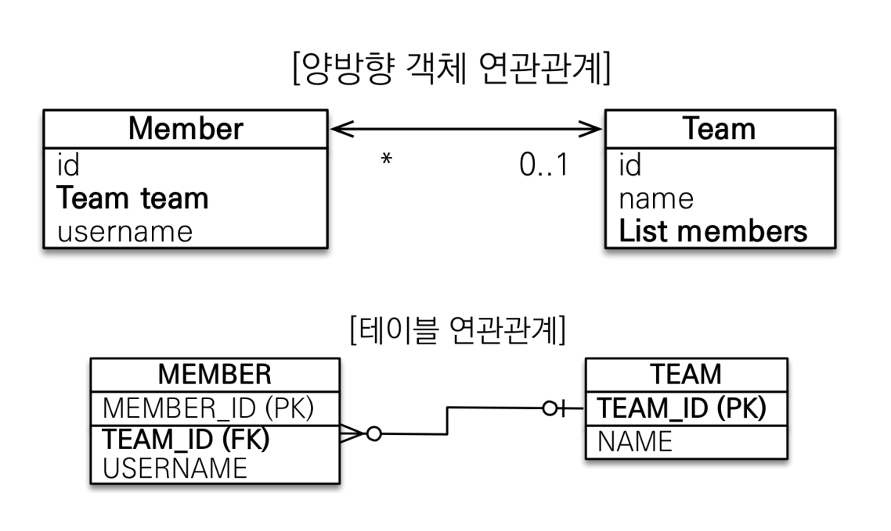

# 5. 연관관계매핑 - 단방향 연관관계 매핑

## 목표
  

## 시나리오
  

## 객체 지향 모델링
  

### 시나리오에 따른 엔티티 매핑

<span style="color:cyan; fontweight:bold;">Member 엔티티</span>  
`@ManyToOne`과 `@JoinColumn`을 이용하여 다대일 관계에서 '다'에 해당하는 엔티티에서 조인에 사용되는 '일'에 해당하는 객체에 붙여준다  
`@JoinColumn`에 사용하는 컬럼 명은 조인에 사용되는 자신 테이블의 <span style="color:blue; fontweight:bold;">외래키가 설정된 컬럼 명이다.</span> 예제 기준으로는 Member 테이블의 TEAM_ID이다.  
  
그러면 Team의 PK필드와 Member 외래키 필드가 아래와 같이 코딩만 해주면 연관관계를 맺어주게 된다.

```java
@Entity
public class Member {
    
    @Id @GeneratedValue
    private Long id;
    
    @Column(name = "USERNAME")
    private String name;
    
    @ManyToOne //하나의 팀에 여러 멤버가 소속되어 있으므로
    @JoinColumn(name = "TEAM_ID") //Team 테이블과 조인에 사용되는 Member 테이블의 컬럼이름
    private Team team;
    
    public Member() {}

    public Long getId() {
        return id;
    }

    public void setId(Long id) {
        this.id = id;
    }

    public String getName() {
        return name;
    }

    public void setName(String name) {
        this.name = name;
    }

    public Team getTeam() {
        return team;
    }

    public void setTeam(Team team) {
        this.team = team;
    }
}
```

<span style="color:cyan; fontweight:bold;">Team 엔티티</span>

```java
@Entity
public class Team {
    @Id @GeneratedValue
    @Column(name = "TEAM_ID") 
    private Long id;
    
    private String name;
    
    public Team() {}
    
    public Long getId() {
        return id;
    }
    public void setId(Long id) {
        this.id = id;
    }
    public String getName() {
        return name;
    }

    public void setName(String name) {
        this.name = name;
    }
}
```

### 실행

```java
@public class Main {
    public static void main(String[] args) {
        EntityManagerFactory emf = Persistence.createEntityManagerFactory("H2");
        
        
        //트랜잭션당 하나씩 생성
        EntityManager em = emf.createEntityManager();
        EntityTransaction tx = em.getTransaction();
        try {
            tx.begin(); 

            Team team = new Team();
            team.setName("TeamA");
            em.persist(team);

            Member member = new Member();
            member.setName("member1");
            member.setTeam(team);  // Member에 Team 연관관계 
            em.persist(member);

            tx.commit();
        } catch (Exception e) {
            tx.rollback();
        } finally {
            em.close();
        }
        emf.close();

    }
}
```

## 양방향 연관관계와 연관관계의 주인

JPA에서 엔티티는 양방향 매핑이 가능하다.  
<span style="color:red; fontweight:bold;">대체적으로 객체 매핑은 단방향으로 하는 걸 권장</span>한다.(양방향이면 신경쓸게 많음)  

<span style="color:red; fontweight:bold;">연관관계의 주인만이 외래 키를 관리(등록, 수정)할 수 있다.</span>  
<span style="color:blue; fontweight:bold;">연관관계의 주인이 아닌쪽은 읽기만 가능</span>하다.  
<span style="color:red; fontweight:bold;">주인은 mappedBy 속성을 사용하지 않는다.</span>  
<span style="color:green; fontweight:bold;">주인이 아니면 mappedBy 속성으로 주인 지정</span>을 한다.  
주로 <span style="color:red; fontweight:bold;">주인은 외래키가 있는 곳을 주인</span>으로 정해야한다.  
### 양방향 매핑
현재 코드 상에서는 객체 상에서 멤버에서 팀은 조회할 수 있으나 팀에서는 팀에 어떤 멤버가 있는지 알 수 없다.  
그래서 팀에서 멤버를 참조하기 위한 `List`를 추가 하고 `@OneToMany`를 `List`에 붙인다.
  

### 엔티티 매핑
```java
@Entity
public class Member {
    
    @Id @GeneratedValue
    private Long id;
    
    @Column(name = "USERNAME")
    private String name;
    
    @ManyToOne //하나의 팀에 여러 멤버가 소속되어 있으므로
    @JoinColumn(name = "TEAM_ID") //조인되는 컬럼이름
    private Team team;
    
    public Member() {}

    public Long getId() {
        return id;
    }

    public void setId(Long id) {
        this.id = id;
    }

    public String getName() {
        return name;
    }

    public void setName(String name) {
        this.name = name;
    }

    public Team getTeam() {
        return team;
    }

    public void setTeam(Team team) {
        this.team = team;
    }
}
```
```java
@Entity
public class Team {
    @Id
    @GeneratedValue
    @Column(name = "TEAM_ID")
    private Long id;
    
    private String name;
    
    /**
     * 다음과 같이 양방향 매핑이 가능하다.
     * 팀에 속한 멤버들을 확인하기 위한 매핑이다.
     * 대체적으로 객체 매핑은 단방향으로 하는 걸 권장한다.(양방향이면 신경쓸게 많음)
     * 
     * 다음은 Member클래스의 team 프로퍼티와 연관되어 매핑됨
     * 연관관계의 주인만이 외래 키를 관리(등록, 수정)할 수 있다.
     * 연관관계의 주인이 아닌쪽은 읽기만 가능!!! 중요!!!
     * 주인은 mappedBy 속성을 사용하지 않는다.
     * 주인이 아니면 mappedBy 속성으로 주인 지정을 한다
     * 주로 주인은 외래키가 있는 곳을 주인으로 정해야한다
     */
    @OneToMany(mappedBy = "team")
    private List<Member> members = new ArrayList<>(); //Null 포인터 방지
    
    public Team() {}
    
    public Long getId() {
        return id;
    }
    public void setId(Long id) {
        this.id = id;
    }
    public String getName() {
        return name;
    }

    public void setName(String name) {
        this.name = name;
    }
    public List<Member> getMembers() {
        return members;
    }
    public void addMember(Member member) {
        this.members.add(member); //한번에 연관관계 처리
        member.setTeam(this);
    }
}
```

### 실행
```java
ublic class Main {
    public static void main(String[] args) {
        EntityManagerFactory emf = Persistence.createEntityManagerFactory("H2");
        
        
        //트랜잭션당 하나씩 생성
        EntityManager em = emf.createEntityManager();
        EntityTransaction tx = em.getTransaction();
        try {
            tx.begin(); 

            Team team = new Team();
            team.setName("TeamA");
            em.persist(team);

            Member member = new Member();
            member.setName("member1");
            member.setTeam(team);  // Member에 Team 연관관계 
            em.persist(member);
            tx.commit();
        } catch (Exception e) {
            tx.rollback();
        } finally {
            em.close();
        }
        emf.close();
    }
}
```

### 양방향 매핑 코드의 실행시 문제점
양방향 매핑에서 위코드에서 문제점은 Member 입장에서는 Team과 연관관계를 맺었는데 메모리 상에서는 Team 기준으로  
Member를 메모리 상에서 사용할 수 없다. 이럴때는 연관관계 편의 메서드를 작성하여 다음과 같이 해준다.

```java
@Entity
public class Team {
    //...

    // 연관관계 편의 메서드
    public void addMember(Member member) {
        this.members.add(member); //한번에 연관관계 처리 - 여기서는 단순하게 했지만 실제로는 같은 PK를 물고 있는 객체가 있으면 찾아서 삭제하고 더 해줘야 하는 로직 추가
        member.setTeam(this);
    }
}
```

```java
public class Main {
    public static void main(String[] args) {
        EntityManagerFactory emf = Persistence.createEntityManagerFactory("H2");
        
        
        //트랜잭션당 하나씩 생성
        EntityManager em = emf.createEntityManager();
        EntityTransaction tx = em.getTransaction();
        try {
            tx.begin(); 

            Team team = new Team();
            team.setName("TeamA");
            em.persist(team);

            Member member = new Member();
            member.setName("member1");
            member.setTeam(team);  // Member에 Team 연관관계를 설정
            em.persist(member);

            /** 객체간 연관관계를 연관관계 편의 메서드를 통해서 맺어줌 */
            team.addMember(member);
            tx.commit();
        } catch (Exception e) {
            tx.rollback();
        } finally {
            em.close();
        }
        emf.close();
    }
}
```