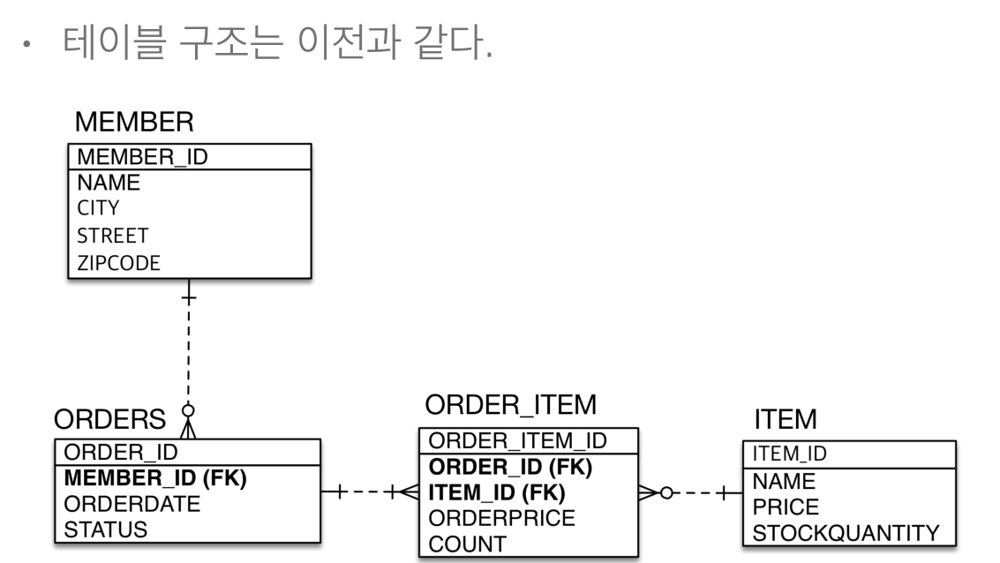
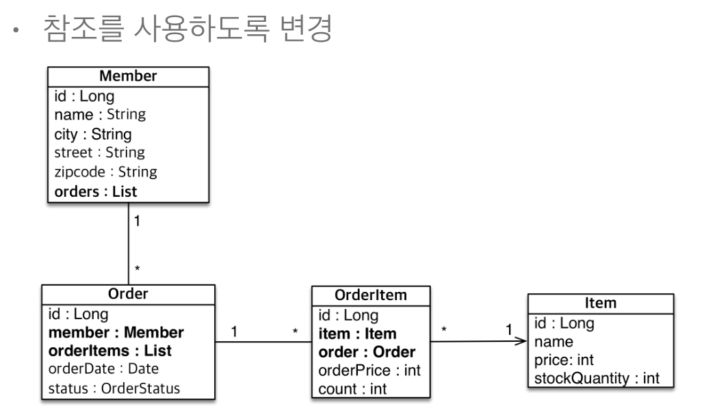

# 5-02. 실전예제2 - 연관관계 매핑  

## 테이블 구조


## 객체 구조
`다대다` 테이블은 OrderItem 테이블 처럼 `1대다` `다대1` 형태로 풀어주는 것이 좋다.  
`다대다` 테이블에서는 컬럼이 추가적으로 필요할 시 추가가 힘들기 때문이다.  
실무에서의 비즈니스는 더 복잡하기 때문에 이점을 기억하자!!!  


## 구현

enum 인 **OrderStutus** 
```java
public enum OrderStatus {
    ORDER, CANCEL
}
```
**Member** 엔티티  

```java
@Entity
public class Member {
    
    @Id
    @GeneratedValue
    @Column(name = "MEMBER_ID")
    private Long id;
    private String name;
    private String city;
    private String street;
    private String zipcode;
    
   //좋은 설계는 아니지만 그냥 JPA 학습용도 - 양방향 매핑과 편의주의적 설계는 되도록 지양하자!!
    @OneToMany(mappedBy = "member")
    private List<Order> orders = new ArrayList<>(); 
    
    public Member() {}
    
    public List<Order> getOrders() {
        return orders;
    }

    public void addOrder(Order order) {
        order.setMember(this); //양방향 객체관계를 맺어줌
        this.orders.add(order);
    }
    
    public Long getId() {
        return id;
    }
    public void setId(Long id) {
        this.id = id;
    }
    public String getName() {
        return name;
    }
    public void setName(String name) {
        this.name = name;
    }
    public String getCity() {
        return city;
    }
    public void setCity(String city) {
        this.city = city;
    }
    public String getStreet() {
        return street;
    }
    public void setStreet(String street) {
        this.street = street;
    }
    public String getZipcode() {
        return zipcode;
    }
    public void setZipcode(String zipcode) {
        this.zipcode = zipcode;
    }
}
```
**Order** 엔티티  

```java
@Entity
@Table(name = "ORDERS")
public class Order {
    @Id @GeneratedValue
    @Column(name = "ORDER_ID")
    private Long id;
    
    @ManyToOne
    @JoinColumn(name = "MEMBER_ID")
    private Member member;
    private LocalDateTime orderDate;
    
    @Enumerated(EnumType.STRING)
    private OrderStatus status;
    
    @OneToMany(mappedBy = "order")
    List<OrderItem> orderItems = new ArrayList<>();
    
    public Order() {}

    
    public List<OrderItem> getOrderItems() {
        return orderItems;
    }

    public void addOrderItem(OrderItem orderItem) {
        orderItem.setOrder(this); //양방향 객체관계를 맺어줌
        this.orderItems.add(orderItem);
    }

    public Long getId() {
        return id;
    }

    public void setId(Long id) {
        this.id = id;
    }

    public Member getMember() {
        return member;
    }

    public void setMember(Member member) {
        this.member = member;
    }

    public LocalDateTime getOrderDate() {
        return orderDate;
    }

    public void setOrderDate(LocalDateTime orderDate) {
        this.orderDate = orderDate;
    }

    public OrderStatus getStatus() {
        return status;
    }

    public void setStatus(OrderStatus status) {
        this.status = status;
    }
    
}
```

**Item** 엔티티  

```java
@Entity
public class Item {
    
    @Id @GeneratedValue
    @Column(name = "ITEM_ID")
    private Long id;
    private String name;
    private Integer price;
    private Integer stockQuantity;
    
    public Item() { }
    
    public Long getId() {
        return id;
    }
    public void setId(Long id) {
        this.id = id;
    }
    public String getName() {
        return name;
    }
    public void setName(String name) {
        this.name = name;
    }
    public Integer getPrice() {
        return price;
    }
    public void setPrice(Integer price) {
        this.price = price;
    }
    public Integer getStockQuantity() {
        return stockQuantity;
    }
    public void setStockQuantity(Integer stockQuantity) {
        this.stockQuantity = stockQuantity;
    }
}
```

**OrderItem** 엔티티  

```java
@Entity
@Table(name = "ORDER_ITEM")
public class OrderItem {
    
    @Id @GeneratedValue
    @Column(name = "ORDER_ITEM_ID")
    private Long id;
    
    @ManyToOne
    @JoinColumn(name = "ORDER_ID")
    private Order order;
    
    @ManyToOne
    @JoinColumn(name = "ITEM_ID")
    private Item item;
    private Integer orderPrice;
    private Integer orderCount;
    
    public OrderItem() { }

    public Long getId() {
        return id;
    }

    public void setId(Long id) {
        this.id = id;
    }

    public Order getOrders() {
        return order;
    }

    public void setOrder(Order order) {
        this.order = order;
    }

    public Item getItem() {
        return item;
    }

    public void setItem(Item item) {
        this.item = item;
    }

    public Integer getOrderPrice() {
        return orderPrice;
    }

    public void setOrderPrice(Integer orderPrice) {
        this.orderPrice = orderPrice;
    }

    public Integer getOrderCount() {
        return orderCount;
    }

    public void setOrderCount(Integer orderCount) {
        this.orderCount = orderCount;
    }
}
```