# 5-03. 다양한 연관관계 매핑 - 다대일, 일대다, 일대일

## 다대일
연관관계의 주인은 '다`에 해당하는 테이블(엔티티)에 해당한다.

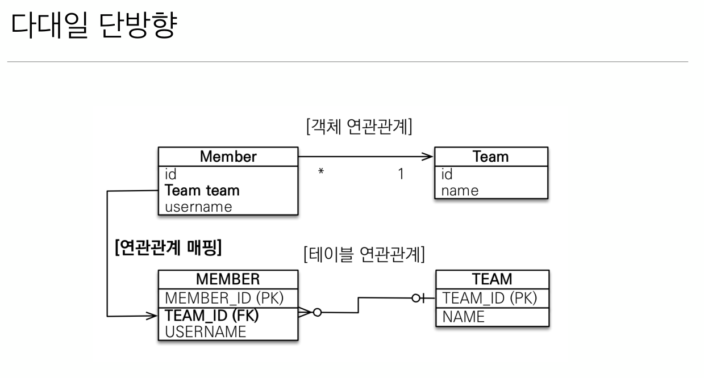  
  
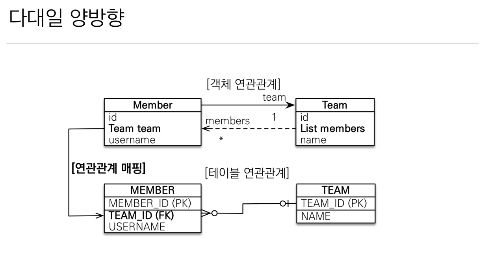  
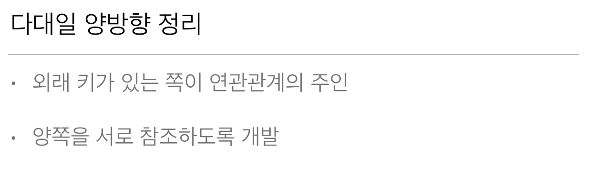  

### 다대일 매핑 예제
하나 팀에는 여러 명의 멤버가 올 수 있다.

<span style="color:cyan; font-weight:bold;">Member</span> 엔티티  

Member 입장에서 Team을 바라볼때는 다대일 관계이다

```java
@Entity
public class Member {
    
    @Id @GeneratedValue
    private Long id;
    
    @Column(name = "USERNAME")
    private String name;
    
    @ManyToOne //멤버와 팀은 다대일 관계다
    @JoinColumn(name = "TEAM_ID") //Team과 조인되는데 사용되는 외래키가 설정된 Member 컬럼이름
    private Team team;
    
    public Member() {}

    public Long getId() {
        return id;
    }

    public void setId(Long id) {
        this.id = id;
    }

    public String getName() {
        return name;
    }

    public void setName(String name) {
        this.name = name;
    }

    public Team getTeam() {
        return team;
    }

    public void setTeam(Team team) {
        this.team = team;
    }
}
```

<span style="color:cyan; font-weight:bold;">Team</span> 엔티티  
팀 입장에서 멤버를 바라볼때는 일대다 관계이다.  
양방향 매핑시 외래키가 있는 Member가 연관관계의 주인이 되기 때문에 `@OneToMany`로 매핑되어있는 `List`는 읽기만 가능  
`em.flush()`를 호출하고 `em.find()`해서 다시 Team 객체를 가져오지 않는 한 메모리 상에서는 팀안에 매핑되어 있는 멤버 `List`에  
멤버가 없기 때문에 코드상에서 연관관계 편의 메서드로 연관관계를 맺어주자. 

```java
@Entity
public class Team {
    @Id
    @GeneratedValue
    @Column(name = "TEAM_ID")
    private Long id;
    
    private String name;
    
    /**
     * 다음과 같이 양방향 매핑이 가능하다.
     * 팀에 속한 멤버들을 확인하기 위한 매핑이다.
     * 대체적으로 객체 매핑은 단방향으로 하는 걸 권장한다.(양방향이면 신경쓸게 많음)
     * 
     * 다음은 Member클래스의 team 프로퍼티와 연관되어 매핑됨
     * 연관관계의 주인만이 외래 키를 관리(등록, 수정)할 수 있다.
     * 연관관계의 주인이 아닌쪽은 읽기만 가능!!! 중요!!!
     * 주인은 mappedBy 속성을 사용하지 않는다.
     * 주인이 아니면 mappedBy 속성으로 주인 지정을 한다
     * 주로 주인은 외래키가 있는 곳을 주인으로 정해야한다
     */
    @OneToMany(mappedBy = "team")
    private List<Member> members = new ArrayList<>(); //Null 포인터 방지
    
    public Team() {}
    
    public Long getId() {
        return id;
    }
    public void setId(Long id) {
        this.id = id;
    }
    public String getName() {
        return name;
    }

    public void setName(String name) {
        this.name = name;
    }
    public List<Member> getMembers() {
        return members;
    }
    /** 연관관계 편의 메서드 */
    public void addMember(Member member) {
        this.members.add(member); //한번에 연관관계 처리
        member.setTeam(this);
    }
}
```

```java

public class Main {
    public static void main(String[] args) {
        EntityManagerFactory emf = Persistence.createEntityManagerFactory("H2");
        
        
        //트랜잭션당 하나씩 생성
        EntityManager em = emf.createEntityManager();
        EntityTransaction tx = em.getTransaction();
        try {
            tx.begin(); 

            Team team = new Team();
            team.setName("TeamA");
            em.persist(team);

            Member member = new Member();
            member.setName("member1");
            member.setTeam(team);  // Member에 Team 연관관계 
            em.persist(member);

            /** 객체간 연관관계를 연관관계 편의 메서드를 통해서 맺어줌 */
            team.addMember(member);
            tx.commit();
        } catch (Exception e) {
            tx.rollback();
        } finally {
            em.close();
        }
        emf.close();
    }
}
```
## 일대다 
연관관계의 주인은 '일'에 해당하는 테이블(엔티티)에 해당한다.

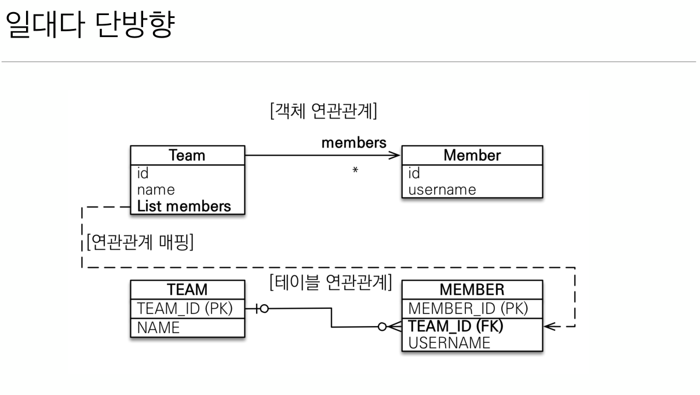  
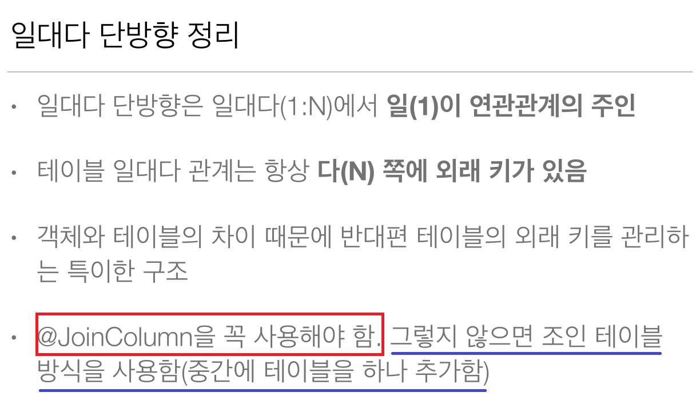  
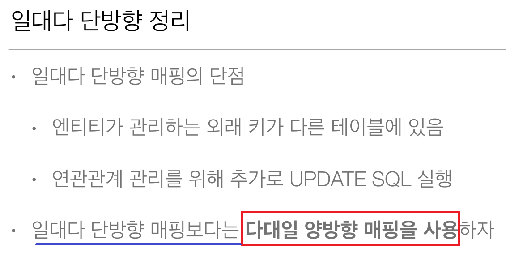  
  
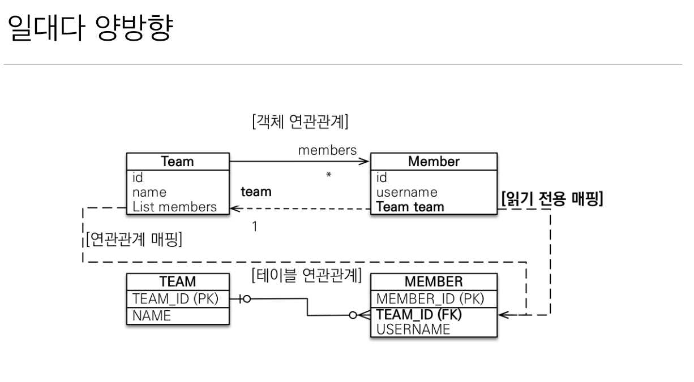  
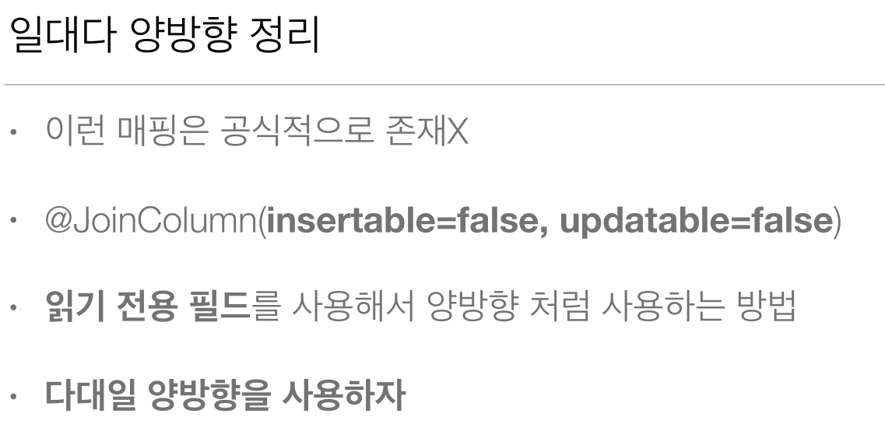  
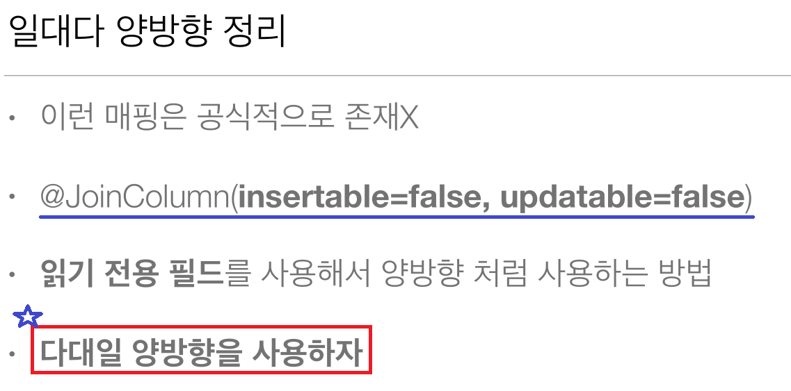  

### 일대다 단방향 매핑 예제

<span style="color:cyan; font-weight:bold;">Team</span> 엔티티  
팀과 멤버는 일대다 관계다 여기서 연관관계 주인은 '일'에 해당하는 팀에 설정되어 있으므로 팀에 `@JoinColumn`을 사용한다.

```java
@Entity
public class Team {
    @Id
    @GeneratedValue
    @Column(name = "TEAM_ID")
    private Long id;
    
    private String name;
    
    /** Team에 연관관계 주인 설정 */
    @OneToMany
    @JoinColumn(name = "TEAM_ID")
    private List<Member> members = new ArrayList<>(); //Null 포인터 방지
    
    public Team() {}
    
    public Long getId() {
        return id;
    }
    public void setId(Long id) {
        this.id = id;
    }
    public String getName() {
        return name;
    }

    public void setName(String name) {
        this.name = name;
    }
    public List<Member> getMembers() {
        return members;
    }
    /** 연관관계 편의 메서드 */
    public void addMember(Member member) {
        this.members.add(member); //한번에 연관관계 처리
        member.setTeam(this);
    }
}
```

<span style="color:cyan; font-weight:bold;">Member</span> 엔티티  

```java
@Entity
public class Member {
    
    @Id @GeneratedValue
    private Long id;
    
    @Column(name = "USERNAME")
    private String name;
    
    public Member() {}

    public Long getId() {
        return id;
    }

    public void setId(Long id) {
        this.id = id;
    }

    public String getName() {
        return name;
    }

    public void setName(String name) {
        this.name = name;
    }

    public Team getTeam() {
        return team;
    }
}
```

<span style="color:cyan; font-weight:bold;">실행</span> 엔티티  

```java
public class Main {
    public static void main(String[] args) {
        EntityManagerFactory emf = Persistence.createEntityManagerFactory("H2");
        
        
        //트랜잭션당 하나씩 생성
        EntityManager em = emf.createEntityManager();
        EntityTransaction tx = em.getTransaction();
        try {
            tx.begin(); 

            Team team = new Team();
            team.setName("TeamA");
            em.persist(team);

            Member member = new Member();
            member.setName("member1");
            em.persist(member);

            /** 객체간 연관관계를 연관관계 편의 메서드를 통해서 맺어줌 */
            team.addMember(member);
            tx.commit();
        } catch (Exception e) {
            tx.rollback();
        } finally {
            em.close();
        }
        emf.close();
    }
}
```

### 일대다 양방향 매핑 예제

<span style="color:cyan; font-weight:bold;">Team</span> 엔티티  
팀과 멤버는 일대다 관계다 여기서 연관관계 주인은 '일'에 해당하는 팀에 설정되어 있으므로 팀에 `@JoinColumn`을 사용한다.  
마찬가지로 '다'에 해당하는 멤버 엔티티에도 팀을 참조하는 객체에도 `@JoinColumn`을 사용하는데 연관관계 주인은 멤버가 아닌 팀이므로  
멤버에서 참조하는 팀은 insert, update는 막고 읽기만 해야한다.  
그렇기 때문에 `@JOinColumn(name = "조인에 사용되는 컬럼명", insertable = false, updatable = false)` 형태로 사용한다.

```java
@Entity
public class Team {
    @Id
    @GeneratedValue
    @Column(name = "TEAM_ID")
    private Long id;
    
    private String name;
    
    /** Team에 연관관계 주인 설정 */
    @OneToMany
    @JoinColumn(name = "TEAM_ID")
    private List<Member> members = new ArrayList<>(); //Null 포인터 방지
    
    public Team() {}
    
    public Long getId() {
        return id;
    }
    public void setId(Long id) {
        this.id = id;
    }
    public String getName() {
        return name;
    }

    public void setName(String name) {
        this.name = name;
    }
    public List<Member> getMembers() {
        return members;
    }
    /** 연관관계 편의 메서드 */
    public void addMember(Member member) {
        this.members.add(member); //한번에 연관관계 처리
        member.setTeam(this);
    }
}
```

<span style="color:cyan; font-weight:bold;">Member</span> 엔티티  

```java
@Entity
public class Member {
    
    @Id @GeneratedValue
    private Long id;
    
    @Column(name = "USERNAME")
    @JOinColumn(name = "TEAM_ID", insertable = false, updatable = false)
    private String name;
    
    public Member() {}

    public Long getId() {
        return id;
    }

    public void setId(Long id) {
        this.id = id;
    }

    public String getName() {
        return name;
    }

    public void setName(String name) {
        this.name = name;
    }

    public Team getTeam() {
        return team;
    }
}
```

## 일대일
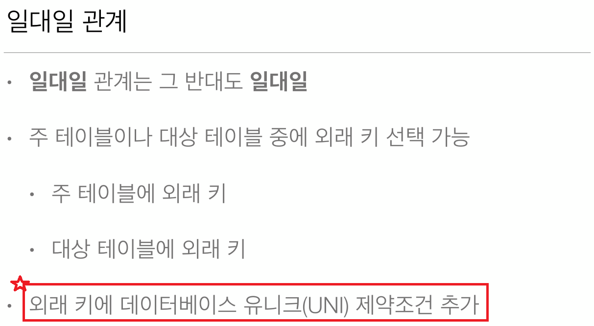  
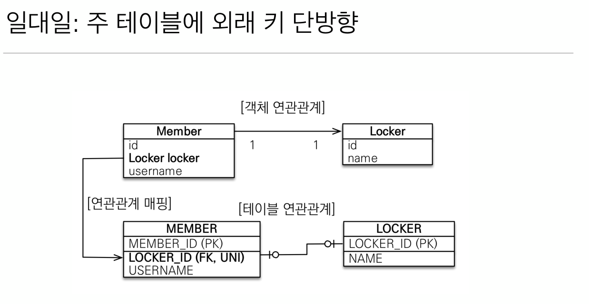  
  
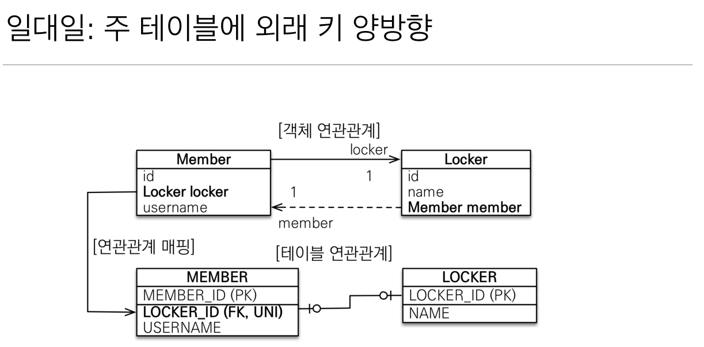  
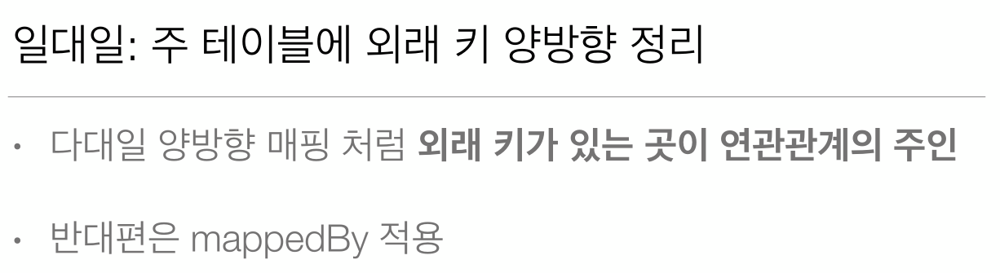  
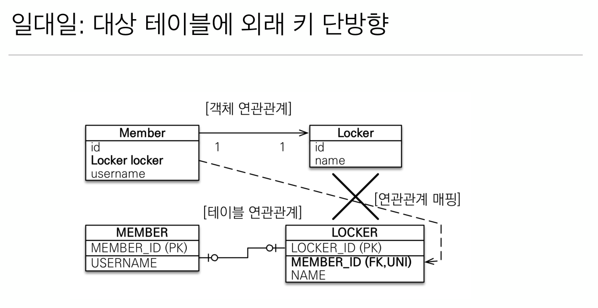  
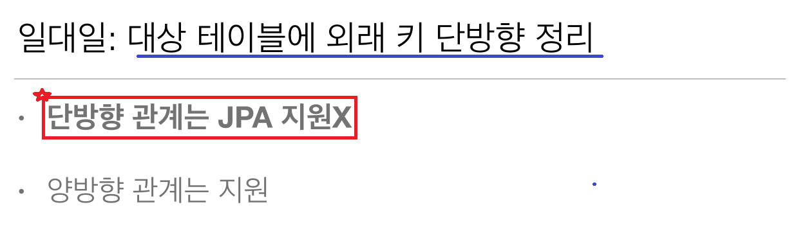  
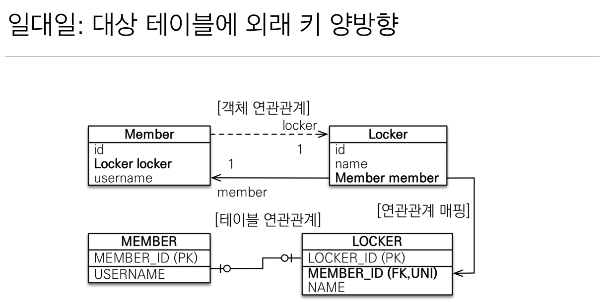  
  
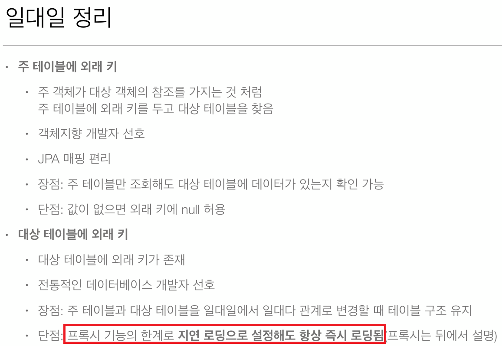  

### 주 테이블에 외래키 단방향

<span style="color:cyan; font-weight:bold;">Locker</span> 엔티티

```java
@Entity
class Locker {
    @id @GeneratedValue
    @Column(name = "LOCKER_ID")
    private Long id

    private String name

    // getter setter 생략
}
```
<span style="color:cyan; font-weight:bold;">Member</span> 엔티티

```java
/**
 *  일대일 이므로 FK에 유니크 제약조건을 추가한다(객체에 설정될 것이 아니면 DB에 이미 걸려있야한다.)
 */
@Entity
@Table(uniqueConstraints = {@UniqueConstraint(columnNames = {"LOCKER_ID"}, name = "MEMBER_UK")}) // 유니크 제약조건이 걸린 컬럼명과 유니크 제약조건 명
public class Member {
    
    @Id @GeneratedValue
    @Column(name = "MEMBER_ID")
    private Long id;
    
    private String userName;
    
    @OneToOne 
    @JoinColumn(name = "LOCKER_ID", foreignKey = @ForeignKey(name="MEMBER_FK")) // 조인에 사용되는 컬럼명과 외래키명
    Locker locker;

    // getter setter 생략
```

### 주 테이블에 외래키 양방향

<span style="color:cyan; font-weight:bold;">Locker</span> 엔티티

```java
@Entity
class Locker {
    @id @GeneratedValue
    @Column(name = "LOCKER_ID")
    private Long id

    private String name

    @MappedBy(name = "locker")  // 양방향 매핑 - 외래키에 Member에 설정이며 Member가 주인이므로 Locker에서 Member는 읽기만 가능
    private Member member

    // getter setter 생략
}
```
<span style="color:cyan; font-weight:bold;">Member</span> 엔티티

```java
/**
 *  일대일 이므로 FK에 유니크 제약조건을 추가한다(객체에 설정될 것이 아니면 DB에 이미 걸려있야한다.)
 */
@Entity
@Table(uniqueConstraints = {@UniqueConstraint(columnNames = {"LOCKER_ID"}, name = "MEMBER_UK")}) // 유니크 제약조건이 걸린 컬럼명과 유니크 제약조건 명
public class Member {
    
    @Id @GeneratedValue
    @Column(name = "MEMBER_ID")
    private Long id;
    
    private String userName;
    
    @OneToOne 
    @JoinColumn(name = "LOCKER_ID", foreignKey = @ForeignKey(name="MEMBER_FK")) // 조인에 사용되는 컬럼명과 외래키명
    Locker locker;

    // getter setter 생략
```

### 대상 테이블에 외래키 양방향

<span style="color:cyan; font-weight:bold;">Locker</span> 엔티티

```java
@Entity
@Table(uniqueConstraints = {@UniqueConstraint(columnNames = {"MEMBER_ID"}, name = "LOCKER_UK")}) // 유니크 제약조건이 걸린 컬럼명과 유니크 제약조건 명
class Locker {
    @id @GeneratedValue
    @Column(name = "LOCKER_ID")
    private Long id

    private String name

    @JoinColumn(name = "MEMBER_ID", foreignKey = @ForeignKey(name="LOCKER_FK")) // 조인에 사용되는 컬럼명과 외래키명
    private Member member

    // getter setter 생략
}
```
<span style="color:cyan; font-weight:bold;">Member</span> 엔티티

```java
/**
 *  일대일 이므로 FK에 유니크 제약조건을 추가한다(객체에 설정될 것이 아니면 DB에 이미 걸려있야한다.)
 */
@Entity
public class Member {
    
    @Id @GeneratedValue
    @Column(name = "MEMBER_ID")
    private Long id;
    
    private String userName;

    @MappedBy(name = "member")
    private Locker locker

    // getter setter 생략
```

