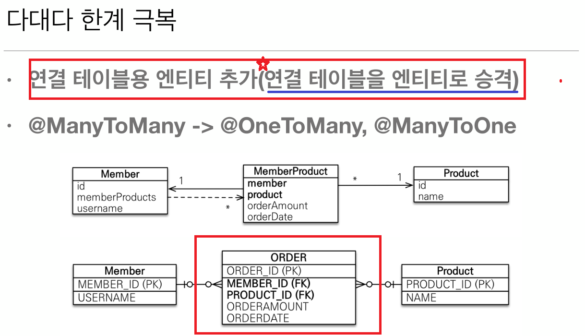

# 5-04. 다양한 연관관계 매핑 - 다대다  
  
  
  
  
  

## 다대다 테이블 매핑 예제
연관관계의 주인이 되는 엔티티는 `@ManyToMany와 @JoinTable`을 사용하고,  
연관관계의 주인이 아닌 엔티티는 `@ManyToMany("mappedBy="참조프로퍼티명")`을 활용하여 처리

<span style="color:cyan; font-weight:bold;">Member</span> 엔티티  

```java
@Entity
public class Member {
    
    @Id @GeneratedValue
    @Column(name = "MEMBER_ID")
    private Long id;
    
    private String userName;
    
    @ManyToMany
    @JoinTable(name = "MEMBER_PRODUCT") //MEMBER_PRODUCT라는 테이블을 통해 조인됨
    private List<Product> products = new ArrayList<>();

    public Member() { }
    
    public List<Product> getProducts() {
        return products;
    }

    public void addProduct(Product product) {
        product.addMember(this);
        this.products.add(product);
    }
    
    public Long getId() {
        return id;
    }

    public void setId(Long id) {
        this.id = id;
    }

    public String getUserName() {
        return userName;
    }

    public void setUserName(String userName) {
        this.userName = userName;
    }
}
```
<span style="color:cyan; font-weight:bold;">Product</span> 엔티티 

```java
@Entity
public class Product {
    
    @Id @GeneratedValue
    @Column(name = "PRODUCT_ID")
    private Long id;

    private String name;
    
    @ManyToMany(mappedBy = "products") //양방향 매핑
    private List<Member> members = new ArrayList<>();
    
    public Product() {}

    public Long getId() {
        return id;
    }

    public void setId(Long id) {
        this.id = id;
    }

    public String getName() {
        return name;
    }

    public void setName(String name) {
        this.name = name;
    }

    public List<Member> getMembers() {
        return members;
    }

    public void addMember(Member member) {
        this.members.add(member);
    }
    
}
```