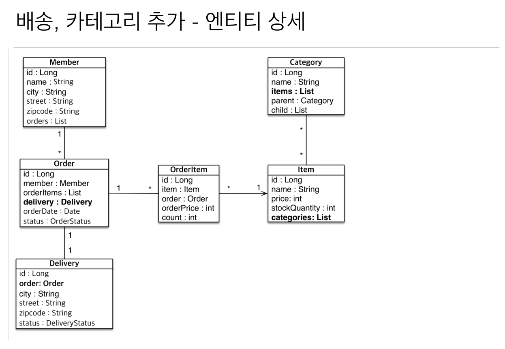

# 05. 다양한 연관관계 매핑 - 실전예제 및 연관관계 매핑 주요 애너테이션과 속성 설명
  
  
  
  
  
  
  

### 엔티티 매핑
**enum** **OrderStatus**   
```java
public enum OrderStatus {
    ORDER, CANCEL
}
```

**enum** **DeliveryStatus**   
```java
public enum DeliveryStatus {
    READY, DELIIVERING, COMPLETE
}
```

**Member** 엔티티  

```java
@Entity
public class Member {
    
    @Id @GeneratedValue
    @Column(name = "MEMBER_ID")
    private Long id;
    private String name;
    private String city;
    private String street;
    private String zipcode;
    
    public Long getId() {
        return id;
    }
    public void setId(Long id) {
        this.id = id;
    }
    public String getName() {
        return name;
    }
    public void setName(String name) {
        this.name = name;
    }
    public String getCity() {
        return city;
    }
    public void setCity(String city) {
        this.city = city;
    }
    public String getStreet() {
        return street;
    }
    public void setStreet(String street) {
        this.street = street;
    }
    public String getZipcode() {
        return zipcode;
    }
    public void setZipcode(String zipcode) {
        this.zipcode = zipcode;
    }
}
```
**Order** 엔티티  

```java
@Entity
@Table(name = "ORDERS")
public class Order {
    
    @Id @GeneratedValue
    @Column(name = "ORDER_ID")
    private Long id;
    
    @ManyToOne
    @JoinColumn(name = "MEMBER_ID")
    private Member member;
    
    @OneToOne
    @JoinColumn(name = "DELIVERY_ID")
    private Delivery delivery;
    
    private LocalDateTime orderDate;
    
    @Enumerated(EnumType.STRING)
    OrderStatus status;

    public Long getId() {
        return id;
    }

    public void setId(Long id) {
        this.id = id;
    }

    public Member getMember() {
        return member;
    }

    public void setMember(Member member) {
        this.member = member;
    }

    public Delivery getDelivery() {
        return delivery;
    }

    public void setDelivery(Delivery delivery) {
        this.delivery = delivery;
    }

    public LocalDateTime getOrderDate() {
        return orderDate;
    }

    public void setOrderDate(LocalDateTime orderDate) {
        this.orderDate = orderDate;
    }

    public OrderStatus getStatus() {
        return status;
    }

    public void setStatus(OrderStatus status) {
        this.status = status;
    }
}
```
**Delivery** 엔티티  

```java
@Entity
public class Delivery {
    
    @Id @GeneratedValue
    @Column(name = "DELIVERY_ID")
    private Long id;
    
    private String city;
    private String street;
    private String zipcode;
    
    @Enumerated(EnumType.STRING)
    private DeliveryStatus status;
    
    public Long getId() {
        return id;
    }
    public void setId(Long id) {
        this.id = id;
    }
    public String getCity() {
        return city;
    }
    public void setCity(String city) {
        this.city = city;
    }
    public String getStreet() {
        return street;
    }
    public void setStreet(String street) {
        this.street = street;
    }
    public String getZipcode() {
        return zipcode;
    }
    public void setZipcode(String zipcode) {
        this.zipcode = zipcode;
    }
    public DeliveryStatus getStatus() {
        return status;
    }
    public void setStatus(DeliveryStatus status) {
        this.status = status;
    }
    
}
```
**OrderItem** 엔티티  

```java
@Entity
@Table(name = "ORDER_ITEM")
public class OrderItem {
    
    @Id @GeneratedValue
    @Column(name = "ORDER_ITEM_ID")
    private Long id;
   
    @ManyToOne
    @JoinColumn(name = "ORDER_ID")
    private Order order;
    
    @ManyToOne
    @JoinColumn(name = "ITEM_ID")
    private Item item;
    
    private Integer orderPrice;
    private Integer count;
    public Long getId() {
        return id;
    }
    public void setId(Long id) {
        this.id = id;
    }
    public Order getOrder() {
        return order;
    }
    public void setOrder(Order order) {
        this.order = order;
    }
    public Item getItem() {
        return item;
    }
    public void setItem(Item item) {
        this.item = item;
    }
    public Integer getOrderPrice() {
        return orderPrice;
    }
    public void setOrderPrice(Integer orderPrice) {
        this.orderPrice = orderPrice;
    }
    public Integer getCount() {
        return count;
    }
    public void setCount(Integer count) {
        this.count = count;
    }
}
```
**Item** 엔티티  

```java
@Entity
public class Item {
    @Id @GeneratedValue
    @Column(name = "ITEM_ID")
    private Long id;
    
    private String name;
    private Integer price;
    private Integer stocktQuantity;
    
    @ManyToMany(mappedBy = "items")
    private List<Category> categories = new ArrayList<>();
    
    public List<Category> getCategories() {
        return categories;
    }
    public void addCategory(Category category) {
        this.categories.add(category);
    }
    public Long getId() {
        return id;
    }
    public void setId(Long id) {
        this.id = id;
    }
    public String getName() {
        return name;
    }
    public void setName(String name) {
        this.name = name;
    }
    public Integer getPrice() {
        return price;
    }
    public void setPrice(Integer price) {
        this.price = price;
    }
    public Integer getStocktQuantity() {
        return stocktQuantity;
    }
    public void setStocktQuantity(Integer stocktQuantity) {
        this.stocktQuantity = stocktQuantity;
    }
}
```
**Category** 엔티티  

```java
@Entity
public class Category {
    
    @Id @GeneratedValue
    @Column(name = "GATEGORY_ID")
    private Long id;
    
    private String name;
    
    @ManyToOne
    @JoinColumn(name = "PARENT_ID")
    private Category parent; //상위 카테고리 셀프 조인(자기자신의 PK를 참조하는 외래키)
    
    
    @OneToMany(mappedBy = "parent")
    private List<Category> child = new ArrayList<Category>();

    //CATEGORY_ITEM을 통해서 ITEM과 다대다 조인
    @ManyToMany
    //joinColumns는 CATEGORY 테이블이 CATEGORY_ITEM 테이블의 CATEGORY_ID와 조인
    //inverseJoinColumns ITEM 테이블이 CATEGORY_ITEM 테이블의 ITEM_ID와 조인
    @JoinTable(name = "CATEGORY_ITEM", 
               joinColumns = @JoinColumn(name = "CATEGORY_ID"), 
               inverseJoinColumns = @JoinColumn(name = "ITEM_ID"))
    private List<Item> items = new ArrayList<>();

    public List<Item> getItems() {
        return items;
    }

    public void addItem(Item item) {
        item.addCategory(this);
        this.items.add(item);
    }

    public List<Category> getChild() {
        return child;
    }

    public void addChild(Category child) {
        child.setParent(this);
        this.child.add(child);
    }
    
    public Long getId() {
        return id;
    }

    public void setId(Long id) {
        this.id = id;
    }

    public String getName() {
        return name;
    }

    public void setName(String name) {
        this.name = name;
    }

    public Category getParent() {
        return parent;
    }

    public void setParent(Category parent) {
        this.parent = parent;
    }
}
```