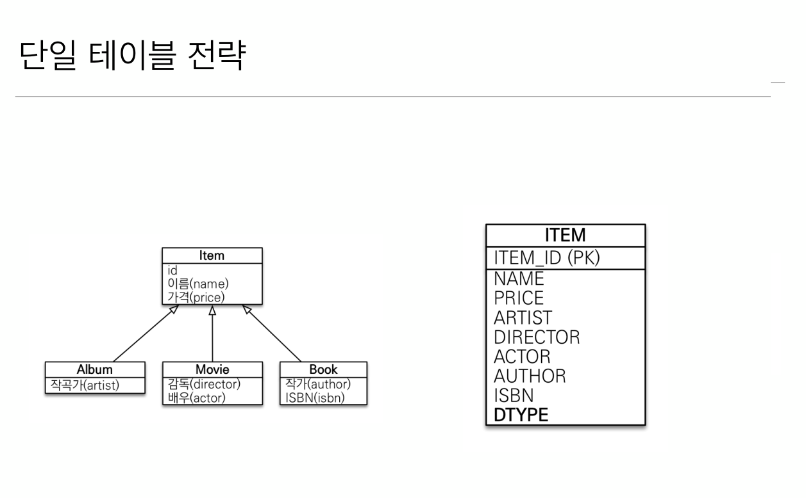
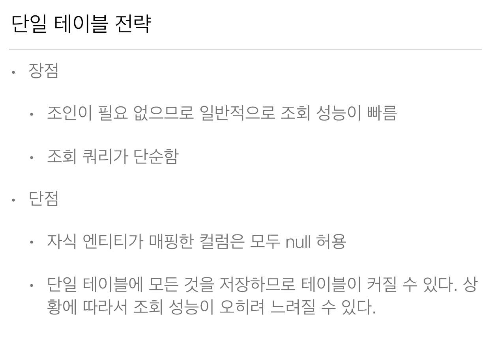

# 6-02. 상속관계 매핑 - 단일 테이블 전략




## 매핑

**Item** 엔티티

```java
@Entity
@Inheritance(strategy = InheritanceType.SINGLE_TABLE)  // 상속관계 매핑 단일 테이블 전략 사용 설정
@DiscriminatorColumn(name = "DTYPE")                   // 단일 테이블에서 각 타입의 데이터를 가져올때 사용되는 컬럼명 - name 속성을 지정하지 않으면 DTYPE 이름으로 매핑
class Item {
    @id @GeneratedValue
    @Column(name = "ITEM_ID")
    private Long id;
    private String name;
    private Long price;
    
    public Item() {}
    //getter setter 생략
}
```
**Album** 엔티티

```java
@Entity
@DiscriminatorValue("A") // @DiscriminatorColumn애너테이션에 정의된 컬럼에 A값이 들어있을 경우 Album과 조인 @DiscriminatorValue를 안붙이면 기본은 엔티티명
class Album extends Item{
    private String artist

    public Album() {}
    //getter setter 생략
} 
```

**Movie** 엔티티

```java
@Entity
@DiscriminatorValue("M") // @DiscriminatorColumn애너테이션에 정의된 컬럼에 M값이 들어있을 경우 Movie와조인 @DiscriminatorValue를 안붙이면 기본은 엔티티명
class Movie extends Item{
    private String director
    private String actor

    public Movie() {}
    //getter setter 생략
} 
```

**Book** 엔티티

```java
@Entity
@DiscriminatorValue("B") // @DiscriminatorColumn애너테이션에 정의된 컬럼에 B값이 들어있을 경우 Book과조인 @DiscriminatorValue를 안붙이면 기본은 엔티티명
class Book extends Item{
    private String authro
    private String isbn

    public Book() {}
    //getter setter 생략
} 
```

