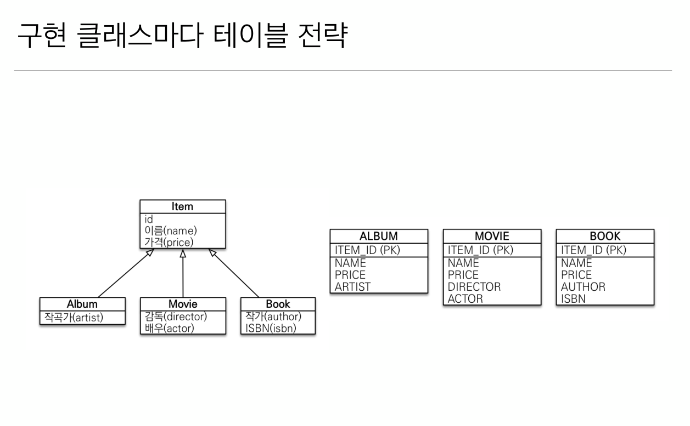
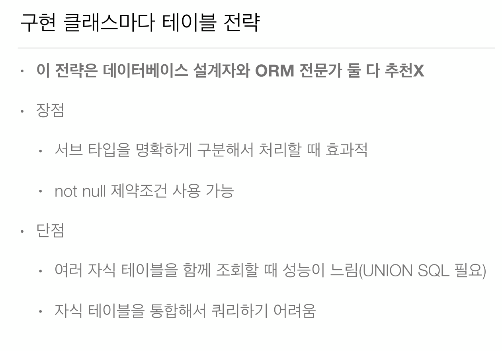

# 6-03. 상속관계 매핑 - 구현 클래스마다 테이블 전략




## 매핑
구현 클래스마다 테이블 전략에서 테이블과 매핑되는 엔티티에서 부모 엔티티가 되는 클래스는 반드시 추상클래스`abstract class`로 선언 되어야 한다  

**Item** 엔티티
```java
@Entity
@Inheritance(strategy = InheritanceType.TABLE_PER_CLASS)  // 구현 클래스마다 테이블 전략 사용 설정
abstract class Item {                                     // 반드시 추상 클래스로 구현되어 있어야 함
    @id @GeneratedValue
    @Column(name = "ITEM_ID")
    private Long id;
    private String name;
    private Long price;
    
    public Item() {}
    //getter setter 생략
}
```
**Album** 엔티티

```java
@Entity
class Album extends Item{
    private String artist

    public Album() {}
    //getter setter 생략
} 
```

**Movie** 엔티티

```java
@Entity
class Movie extends Item{
    private String director
    private String actor

    public Movie() {}
    //getter setter 생략
} 
```

**Book** 엔티티

```java
@Entity
class Book extends Item{
    private String authro
    private String isbn

    public Book() {}
    //getter setter 생략
} 
```