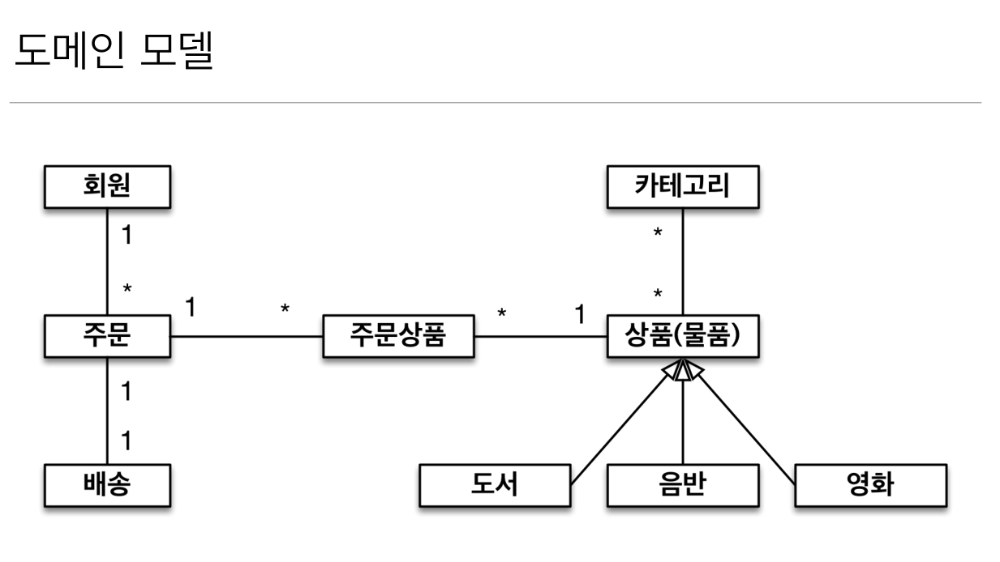
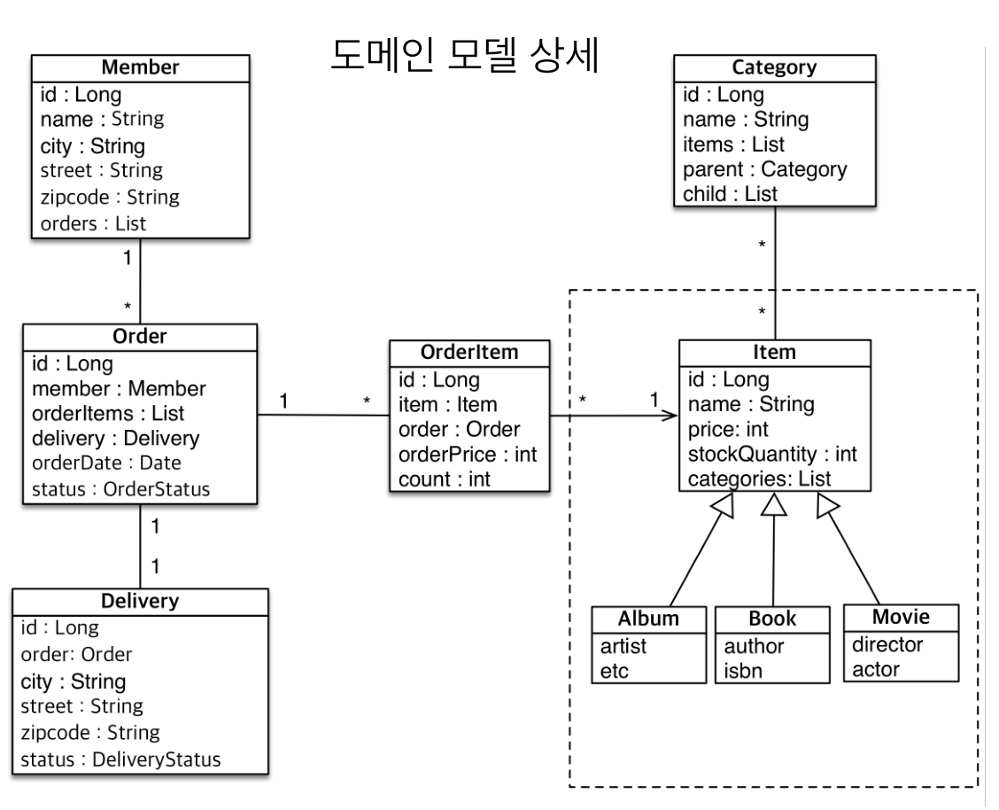
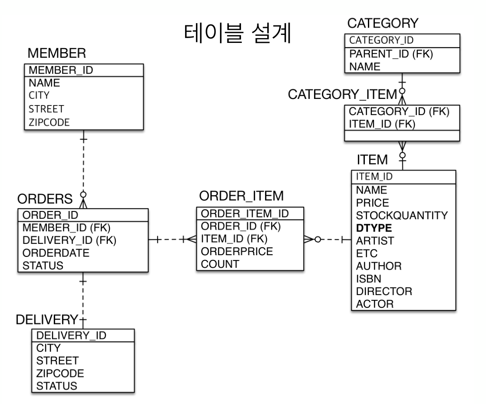

# 6-05. 상속관계 매핑 - 실전예제

  
  
  
  

## 매핑

enum **OrderStatus** 

```java
public enum OrderStatus {
    ORDER, CANCEL
}
```

enum **DeliveryStatus**

```java
public enum DeliveryStatus {
    READY, DELIIVERING, COMPLETE
}
```
**Member** 엔티티
```java
@Entity
public class Member {
    @Id @GeneratedValue
    @Column(name = "MEMBER_ID")
    Long id;

    private String name;
    private String city;
    private String zipCode;

    @OneToMany(mappedBy = "member")
    private List<Order> orders = new ArrayList<>();

    // 생략...
}

```

**Order** 엔티티
```java

@Table(name = "ORDERS", uniqueConstraints = @UniqueConstraint(name = "ORDERS_DELIVERY_UK", columnNames = "DELIVERY_ID"))
@Entity
public class Order {
    @Id @GeneratedValue
    @Column(name = "ORDER_ID")
    private Long id;

    @ManyToOne
    @JoinColumn(name = "MEMBER_ID")
    private Member member;

    @OneToOne
    @JoinColumn(name = "DELIVERY_ID", foreignKey = @ForeignKey(name = "ORDERS_DELIVERY_FK"))
    private Delivery delivery;

    @Enumerated(EnumType.STRING)
    OrderStatus status;

    @OneToMany(mappedBy = "order")
    private List<OrderItem> orderItems = new ArrayList<>();

    // 생략...
}
```

**Delivery** 엔티티
```java
@Entity
public class Delivery {
    
    @Id @GeneratedValue
    @Column(name = "DELIVERY_ID")
    private Long id;

    private String city;
    private String street;
    private String zipCode;

    @Enumerated(EnumType.STRING)
    private DeliveryStatus status;

    @OneToOne(mappedBy = "delivery")
    private Order order;

    // 생략...
}
```

**OrderItem** 엔티티
```java
@Entity
public class OrderItem {
    @Id @GeneratedValue
    @Column(name = "ORDER_ITEM_ID")
    private Long id;

    @ManyToOne
    @JoinColumn(name = "ORDER_ID")
    private Order order;

    @ManyToOne
    @JoinColumn(name = "ITEM_ID")
    private Item item;

    private long orderPrice;
    private long count;

    // 생략...
}
```

**Category** 엔티티
```java
@Entity
public class Category {
    @Id @GeneratedValue
    @Column(name = "CATEGORY_ID")
    private Long id;
    private String name;

    @ManyToOne
    @JoinColumn(name = "PARENT_ID")
    private Category category;
    
    @OneToMany(mappedBy = "category")
    List<Category> categories = new ArrayList<>();

    @ManyToMany(mappedBy = "categories")
    List<Item> items = new ArrayList();

    // 생략...
}
```

**Item** 엔티티
```java
Entity
@Inheritance(strategy = InheritanceType.SINGLE_TABLE)
@DiscriminatorColumn(name = "DTYPE")
public class Item {
    
    @Id @GeneratedValue
    @Column(name = "ITEM_ID")
    private Long id;
    private String name;
    private long price;
    private long stockQuantity;

    @ManyToMany
    @JoinTable(name = "CATEGORY_ITEM",
               joinColumns = @JoinColumn(name = "ITEM_ID"),
               inverseJoinColumns = @JoinColumn(name = "CATEGORY_ID"))
    private List<Category> categories = new ArrayList<>();

    @OneToMany(mappedBy = "item")
    private List<OrderItem> orderItems = new ArrayList<>();

    // 생략...
}

```

**Album** 엔티티
```java
@Entity
@DiscriminatorValue("A")
public class Album extends Item {
    private String artist;
    private String etc;
    
    // 생략...
}

```

**Book** 엔티티
```java
@Entity
@DiscriminatorValue("B")
public class Book extends Item {
    private String author;
    private String isbn;

    // 생략...
}

```

**Movie** 엔티티
```java
@Entity
@DiscriminatorValue("M")
public class Movie extends Item {
    
    private String director;
    private String actor;

    // 생략... 
}

```


