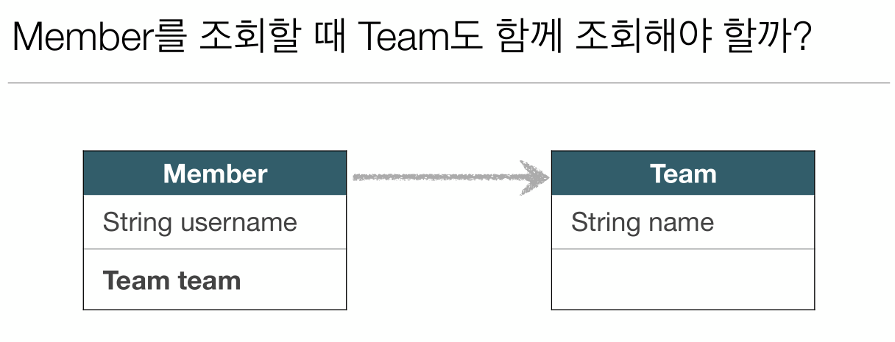
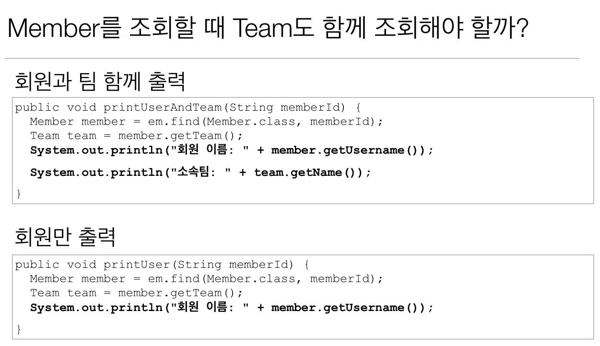
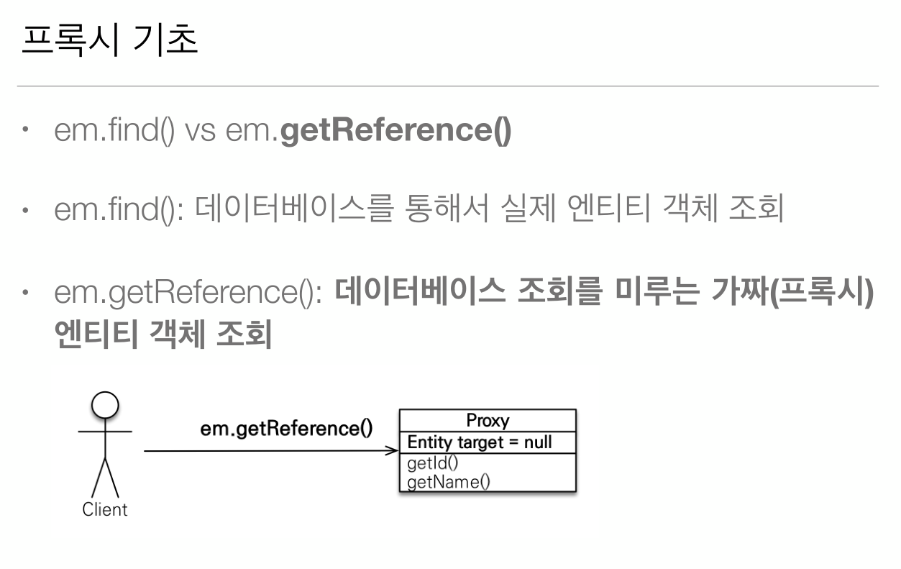
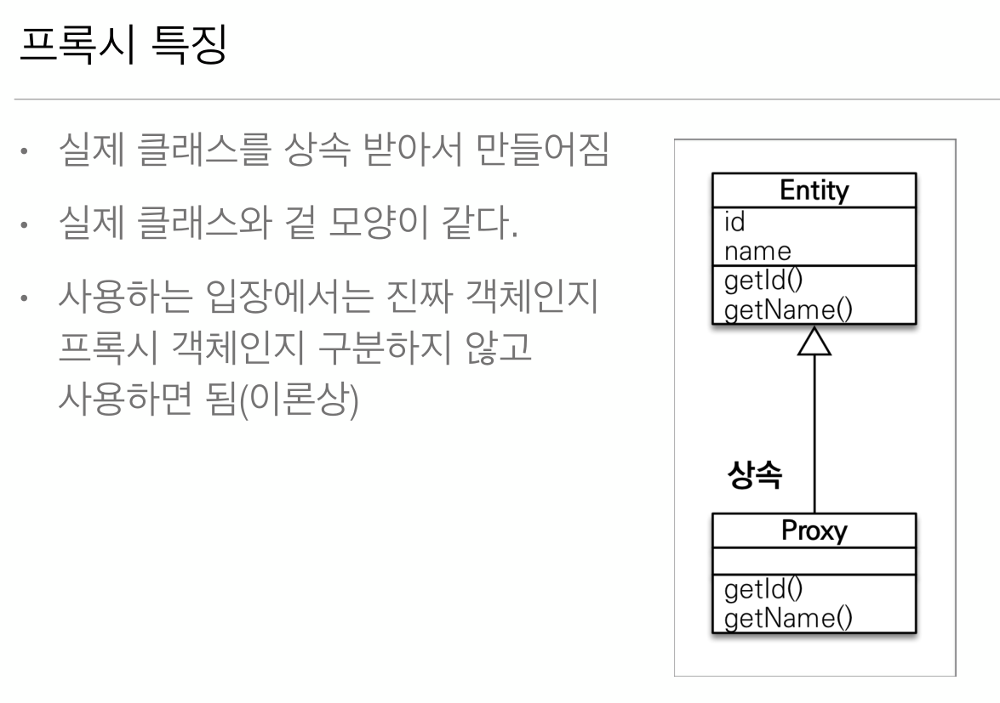
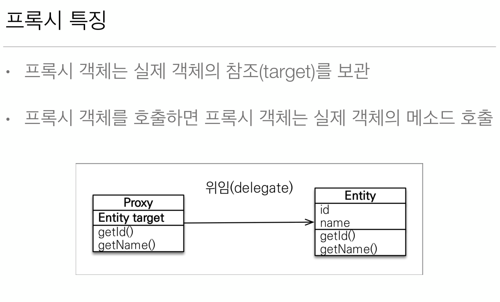
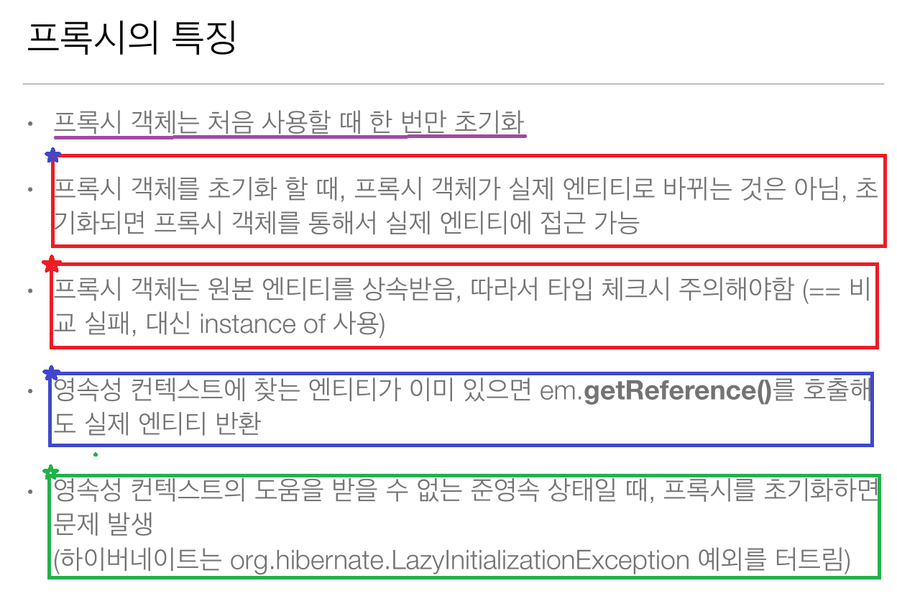
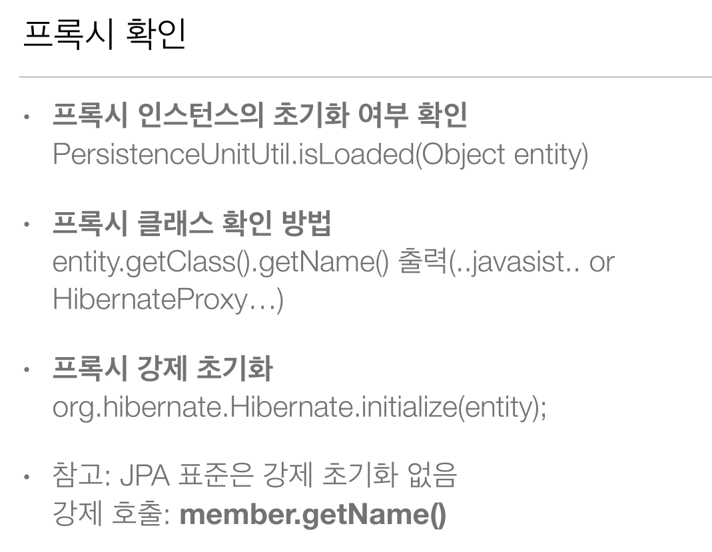

# 7-01. 프록시와 연관관계 관리 - 프록시  
  
  
  
  
  
  
  
  
  

## 프록시 테스트 코드
```java
public class JPAMain {

    public static void main(String[] args) {
        
        EntityManagerFactory emf = Persistence.createEntityManagerFactory("H2");
        
        
        //트랜잭션당 하나씩 생성
        EntityManager em = emf.createEntityManager();
        EntityTransaction tx = em.getTransaction();
        try {
            tx.begin(); // 트랜잭션시작
            
            /**
             * 팀과 멤버 연관 관계 맺어줌
             */
            Member member = insertNewMember(em, "TEAMB", "USER2");

            em.flush();
            em.clear(); // 1차캐시 날림

            /**
             * getReference DB에서 조회하는 것이 아닌 1차적으로 프록시 객체 호출1차 캐시에 있다면 실제 엔티티를 반환)
             * 타입 체크시 주의 == 대신에 instanceof를 사용!!!
             */
            Member findMember = em.getReference(Member.class, member.getId());
            PersistenceUnitUtil persistenceUnitUtil = emf.getPersistenceUnitUtil();
            boolean isLoaded = persistenceUnitUtil.isLoaded(findMember);

            /**
             * 1차 캐시에 엔티티가 없는 상태에서 getReference로 조회하면 프록시 객체가 리턴된다.
             * DB에 가져오는 것이 아니기 때문에 false가 출력
             */
            System.out.println("Proxy's real Entity is Loaded? : " + isLoaded); // false

            System.out.println("=============================================================");
            
            /**
             * 하이버네이트 가짜 엔티티(프록시)조회
             * 프록시는 엔티티 객체를 상속받아 구현된 구현체임
             * type : com.jpa.study.domain.Member$HibernateProxy$Oic0dx4Z
             */
            System.out.println("type : " + findMember.getClass().getName()); 
            System.out.println("Is member's instance? : " + (findMember instanceof Member)); // true
            
            System.out.println("id : " + findMember.getId());     
            System.out.println("name : " + findMember.getName()); //호출하는 시점에 이름 가져옴

            /**
             * 프록시의 메서드가 호출되었기 때문에 true가 찍임
             */
            isLoaded = persistenceUnitUtil.isLoaded(findMember);
            System.out.println("Proxy's real Entity is Loaded? : " + isLoaded);  // true
            
            tx.commit();
        } catch (Exception e) {
            tx.rollback();
        } finally {
            em.close();
        }
        emf.close();

    }
    
    private static Member insertNewMember(EntityManager em, String teamName, String userName) {
        Team team = new Team();
        team.setName(teamName);
        em.persist(team);
        
        Member member = new Member();
        member.setName(teamName);
        member.setTeam(team);
        em.persist(member);
        return member;
    }
}
```

## 프록시 LazyInitailizationException 발생하는 경우
```java
public class LazyInitailizationExceptionMain {

  public static void main(String[] args) {
        
        EntityManagerFactory emf = Persistence.createEntityManagerFactory("H2");
        
        
        //트랜잭션당 하나씩 생성
        EntityManager em = emf.createEntityManager();
        EntityTransaction tx = em.getTransaction();
        try {
            tx.begin(); // 트랜잭션시작
            Member member = insertNewMember(em, "TEAMC", "USER3");
            em.flush();
            em.clear(); // 1차캐시 날림
            
          
            Member refMember = em.getReference(Member.class, member.getId());
            
            System.out.println("=====================");
            
            /**
             * 하이버네이트 가짜 엔티티(프록시)조회
             * 프록시는 엔티티 객체를 상속받아 구현된 구현체임
             * type : com.jpa.study.domain.Member$HibernateProxy$Oic0dx4Z
             */
            System.out.println("type : " + refMember.getClass().getName()); 
            System.out.println("is member's instance? : " + (refMember instanceof Member)); // true
            System.out.println("id : " + refMember.getId());
            
            em.detach(refMember); // refMember 프록시 준영속
            
            /**
             * 1차캐시에서 관리되지 않은 상태이면서 영속상태에서 메서드가 호출되지 않았고 준영속 이후에 
             * 호출할경우 LazyInitailizationException 발생
             */
            System.out.println("name : " + refMember.getName()); 
            
            tx.commit();
        } catch (Exception e) {
            e.printStackTrace();
            tx.rollback();
        } finally {
            em.close();
        }
        emf.close();

    }
    
    private static Member insertNewMember(EntityManager em, String teamName, String userName) {
        Team team = new Team();
        team.setName(teamName);
        em.persist(team);
        
        Member member = new Member();
        member.setName(teamName);
        member.setTeam(team);
        em.persist(member);
        return member;
    }
}
```