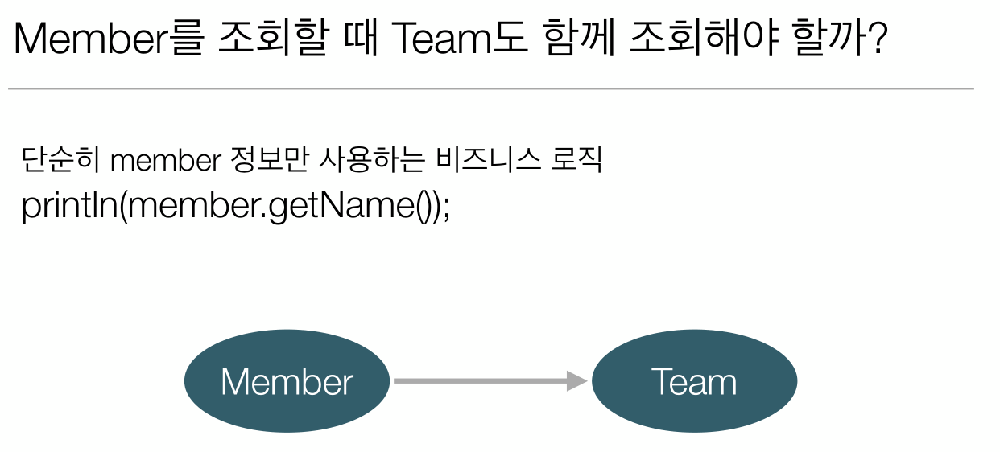
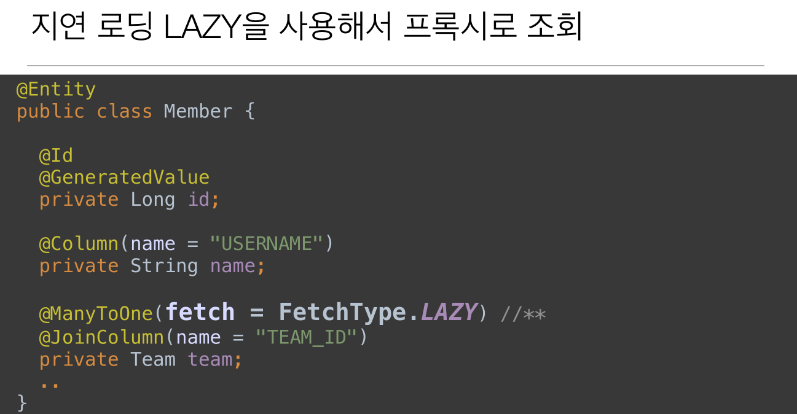
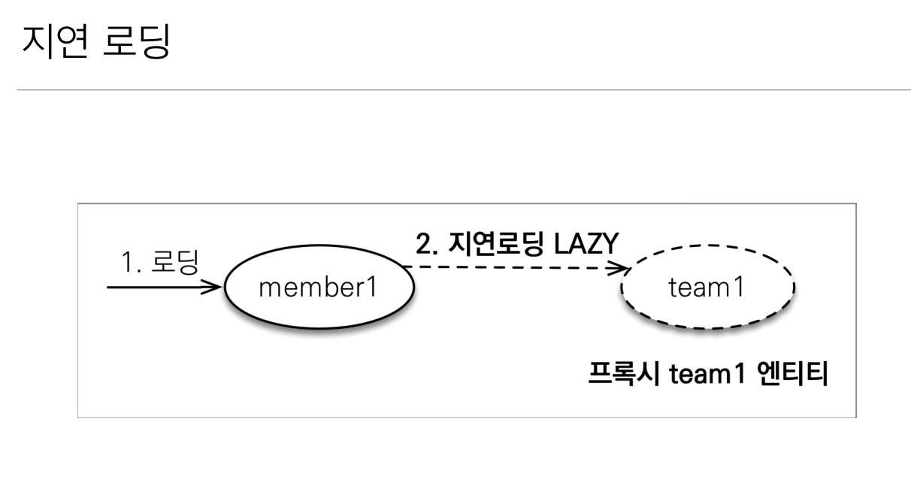
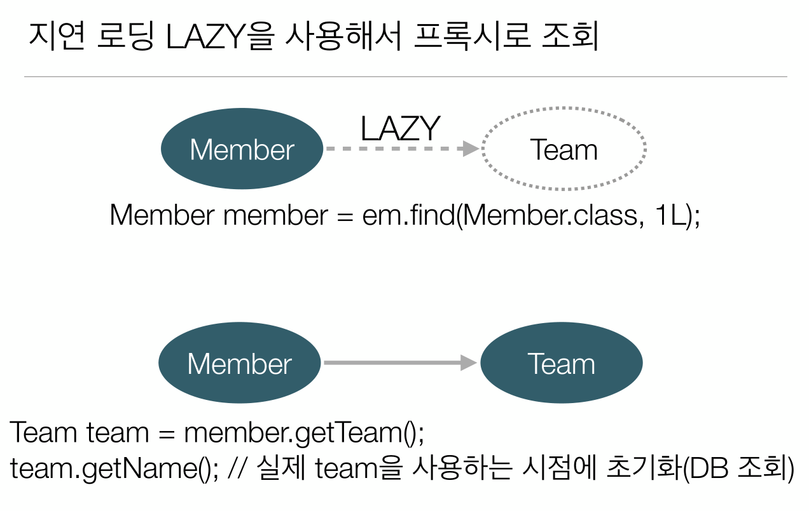

# 7-03. 프록시와 연관관계 관리 - 지연로딩  

  
  
  


**Member** 엔티티
```java
@Entity
public class Member {
    
    @Id @GeneratedValue
    private Long id;
    
    @Column(name = "USERNAME")
    private String name;
    
   //메서드 호출 시점에 디비에서 조회해서 가져옴 그전에는 프록시 객체가 대신 채움 
    @ManyToOne(fetch = FetchType.LAZY)
    @JoinColumn(name = "TEAM_ID") 
    private Team team;
    
    // 생략...
```

**Team** 엔티티
```java
@Entity
public class Team {
    @Id
    @GeneratedValue
    @Column(name = "TEAM_ID")
    private Long id;
    
    private String name;
   
    // 메서드 호출 시점에 디비에서 조회해서 가져옴
    @OneToMany(mappedBy = "team", fetch = FetchType.LAZY) 
    private List<Member> members = new ArrayList<>(); //Null 포인터 방지

    // 생략...
```

```java
public class JPAMain {

    public static void main(String[] args) {
        
        EntityManagerFactory emf = Persistence.createEntityManagerFactory("H2");
        
        
        //트랜잭션당 하나씩 생성
        EntityManager em = emf.createEntityManager();
        EntityTransaction tx = em.getTransaction();
        try {
            tx.begin(); // 트랜잭션시작
            Member member = insertNewMember(em, "TEAMB", "USER2");
            em.flush();
            em.clear();
            
            Member findMember = em.find(Member.class, member.getId()); //Team은 조회안하고 Member만 조회
            System.out.println("get Team information");
            Team team = findMember.getTeam();

            /**
             * type : class com.jpa.study.domain.Team$HibernateProxy$OwZMUvLS
             * 프록시 객체가 대신 세팅됨
             */
            System.out.println("type : " + team.getClass()); 
            System.out.println("Team name : " + team.getName()); //실제 Team엔티티의 메서드를 사용하는 시점에 초기화
            
            tx.commit();
        } catch (Exception e) {
            tx.rollback();
        } finally {
            em.close();
        }
        emf.close();

    }
    
    private static Member insertNewMember(EntityManager em, String teamName, String userName) {
        Team team = new Team();
        team.setName(teamName);
        em.persist(team);
        
        Member member = new Member();
        member.setName(teamName);
        member.setTeam(team);
        em.persist(member);
        return member;
    }
}
```