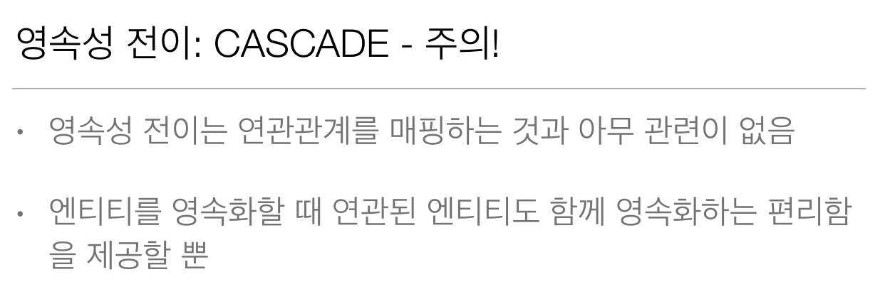

# 7-04. 프록시와 연관관계 관리 - 영속성 전이(CASCADE)와 고아객체  

  
  
  
  
  
  
  

**Parent** 엔티티
```java
/**
 * 영속성 전이 예제
 */
@Entity
public class Parent {
    
    @Id @GeneratedValue
    private Long id;
    
    private String name;
    /**
     * 주로 엔티티 A와 엔티티 B가 연관관계 있을때 사용(A와B는 일대다관계) 즉 특정 엔티티가 단일 엔티티에 완전 종속적일때
     * B연관관계가 A말고 다른 C등과 연관관계 있을때 사용금지
     * ----주로 사용되는 옵션-----
     * ALL : 모두 적용
     * PERSIST : 영속
     * REMOVE : 삭제
     * ---------------------
     * MERGE : 병합
     * REFRESH : REFRESH
     * DETACH : DETACH
     * 
     * 
     * orphanRemoval 부모 엔티티와 연관관계가 끊어진 자식 엔티티를 자동으로 삭제 기본값은 false
     * 마치 CascadeType.REMOVE 처럼 동작함
     * 주로 엔티티 A와 엔티티 B가 연관관계 있을때 사용(A와B는 일대다관계) 즉 특정 엔티티가 단일 엔티티에 완전 종속적일때 (OneToOne, ManyToMany일때)
     * B연관관계가 A말고 다른 C등과 연관관계 있을때 사용금지
     * 
     * ex) Parent parent1 = em.find(Parent.class, id);
     * parent1.getChildren().remove(0); //딜리트 쿼리 나감
     */
    //children에 Child를 넣고 Parent만 persist하면 children에 등록된 child도 모두 1차캐시 및 DB에 등록됨
    @OneToMany(mappedBy = "parent", cascade = CascadeType.ALL, orphanRemoval = true)
    private List<Child> children = new ArrayList<>();
    
    public List<Child> getChildren() {
        return children;
    }

    public void addChild(Child child) {
        if (!Objects.isNull(child.getId())) {
            this.children.removeIf(c -> c.getId().equals(child.getId()));
        }
        this.children.add(child);
        child.setParent(this);
    }

    public Long getId() {
        return id;
    }

    public void setId(Long id) {
        this.id = id;
    }

    public String getName() {
        return name;
    }

    public void setName(String name) {
        this.name = name;
    }
}
```

**Child** 엔티티
```java
@Entity
public class Child {
    
    @Id
    @GeneratedValue
    private Long id;
    
    private String name;
    
    @ManyToOne(fetch = FetchType.LAZY)
    @JoinColumn(name = "PARENT_ID")
    private Parent parent;

    public Long getId() {
        return id;
    }

    public void setId(Long id) {
        this.id = id;
    }

    public String getName() {
        return name;
    }

    public void setName(String name) {
        this.name = name;
    }

    public Parent getParent() {
        return parent;
    }

    public void setParent(Parent parent) {
        this.parent = parent;
    }
}
```

**실행**
```java
public class JPAMain {

    public static void main(String[] args) {
        
        EntityManagerFactory emf = Persistence.createEntityManagerFactory("H2");
        
        
        //트랜잭션당 하나씩 생성
        EntityManager em = emf.createEntityManager();
        EntityTransaction tx = em.getTransaction();
        try {
            tx.begin(); // 트랜잭션시작
            
            Child child1 = new Child();
            child1.setName("child1");
            
            Child child2 = new Child();
            child2.setName("child2");
            
            Parent parent = new Parent();
            // Parent children에 Child를 등록하고 persist는 Parent만 등록하면 Child도 persist된다.
            // 왜냐하면 Parent의 children에 영속성 전이(cascade) 설정을 했기 때문이다.
            parent.addChild(child1);
            parent.addChild(child2);
            em.persist(parent);
            em.flush();
            em.clear();
            
            Parent findParent = em.find(Parent.class, parent.getId());
            findParent.getChildren().remove(0); // DELETE (쿼리 실행 orphanRemoval = true 설정된경우)
            tx.commit();
        } catch (Exception e) {
            e.printStackTrace();
            tx.rollback();
        } finally {
            em.close();
        }
        emf.close();
    }
}
```