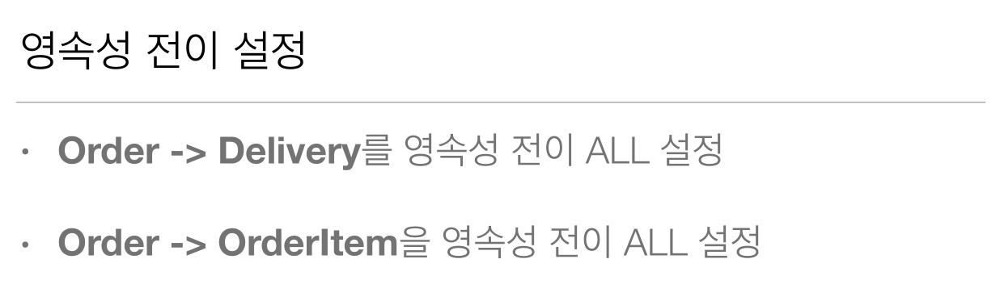

# 7-05. 프록시와 연관관계 관리 - 실전예제  

  
  

**Order** 엔티티 

```java
Entity
@Table(name = "ORDERS")
public class Order {
    
    @Id @GeneratedValue
    @Column(name = "ORDER_ID")
    private Long id;
    
    @ManyToOne(fetch = FetchType.LAZY)
    @JoinColumn(name = "MEMBER_ID")
    private Member member;
    
    @OneToOne(fetch = FetchType.LAZY, cascade = CascadeType.ALL)
    @JoinColumn(name = "DELIVERY_ID")
    private Delivery delivery;
    
    private LocalDateTime orderDate;
    
    @OneToMany(mappedBy = "order", cascade = CascadeType.ALL)
    private List<OrderItem> orderitems = new ArrayList<>();
    // 생략 ...
```