# 9. 임베디드 타입(복합 값 타입)

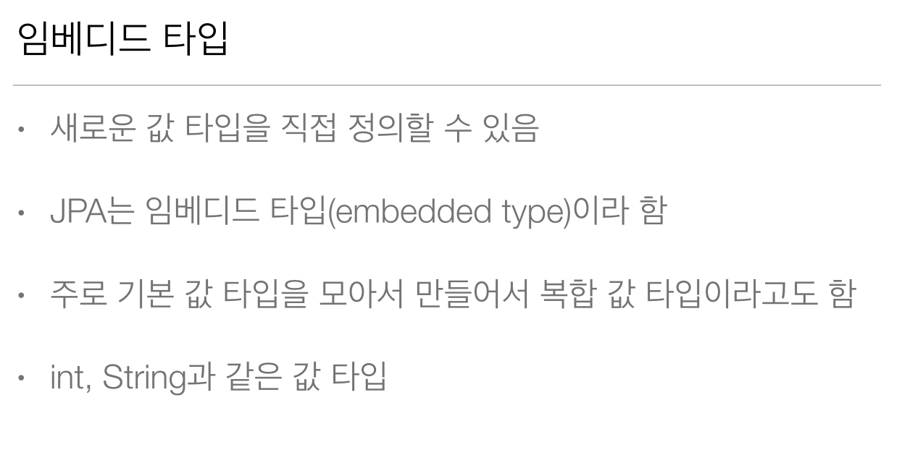  
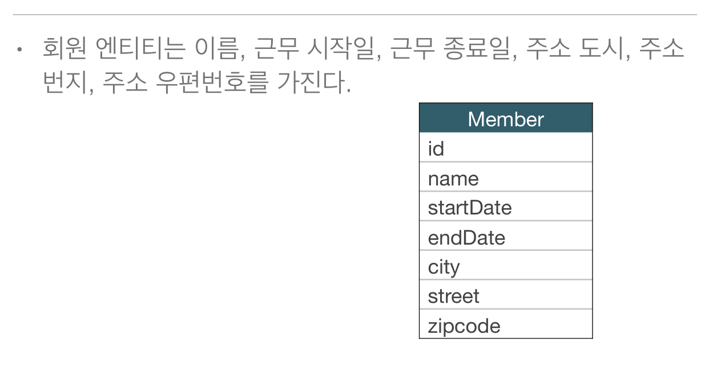  
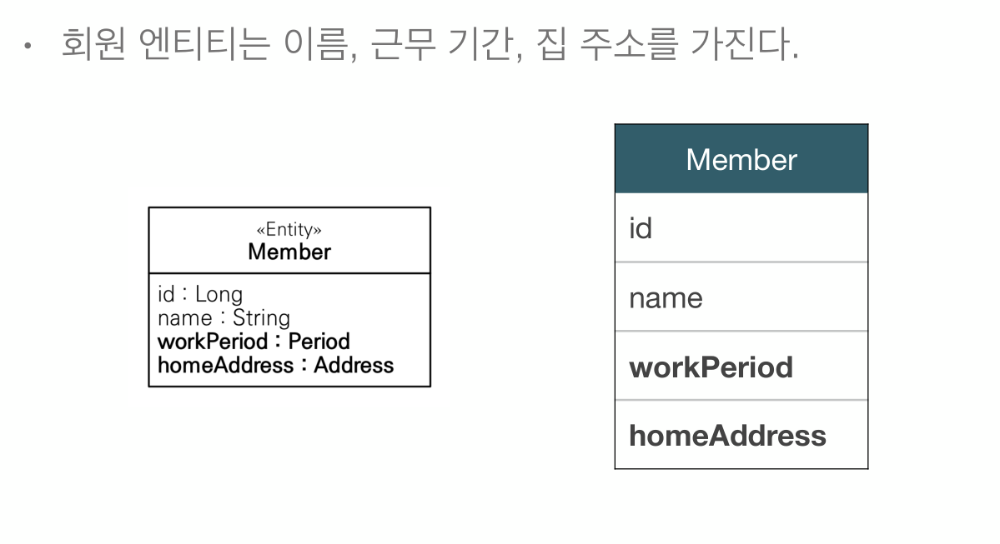  
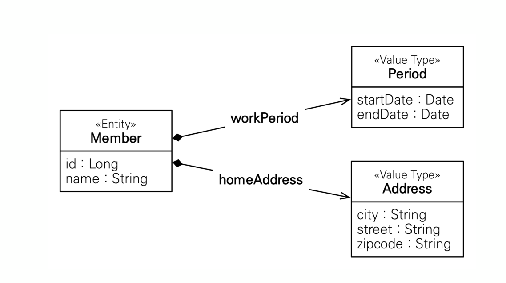  
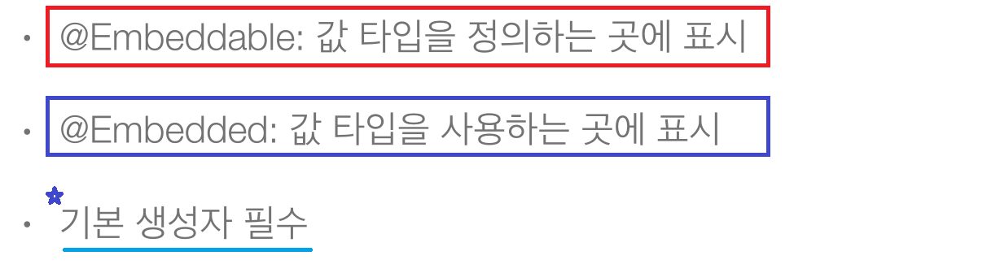  
  
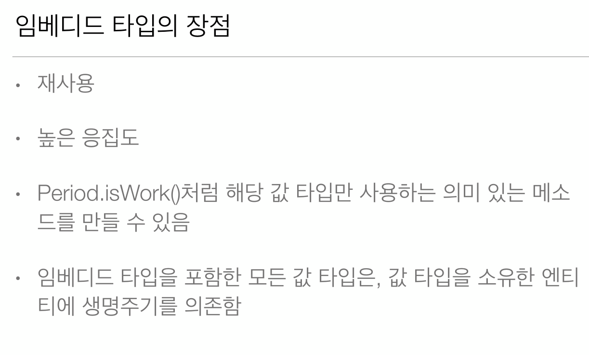  
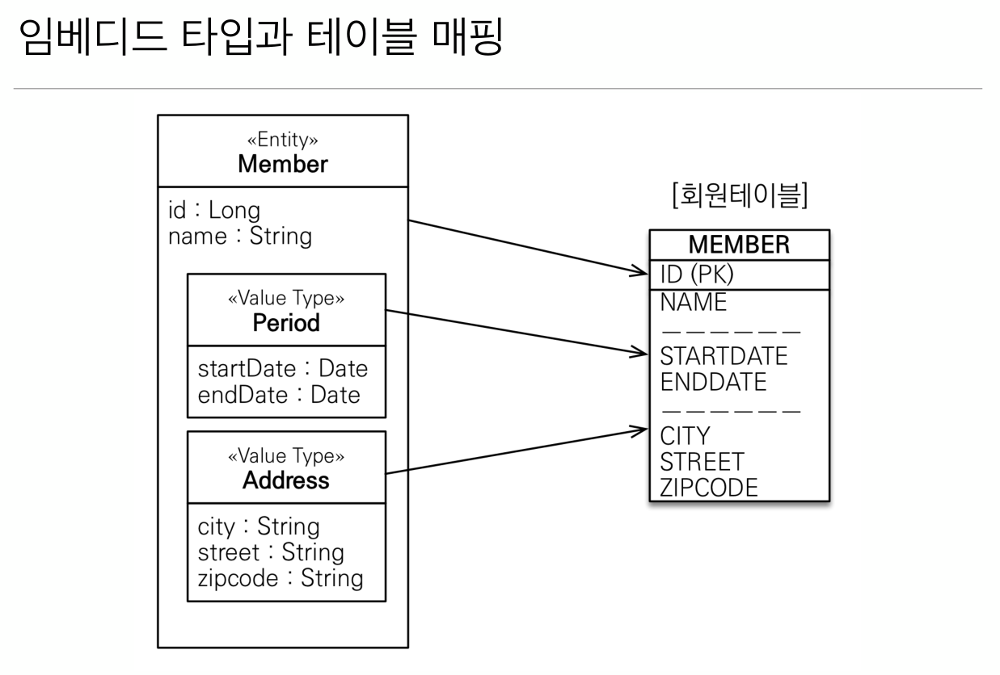  
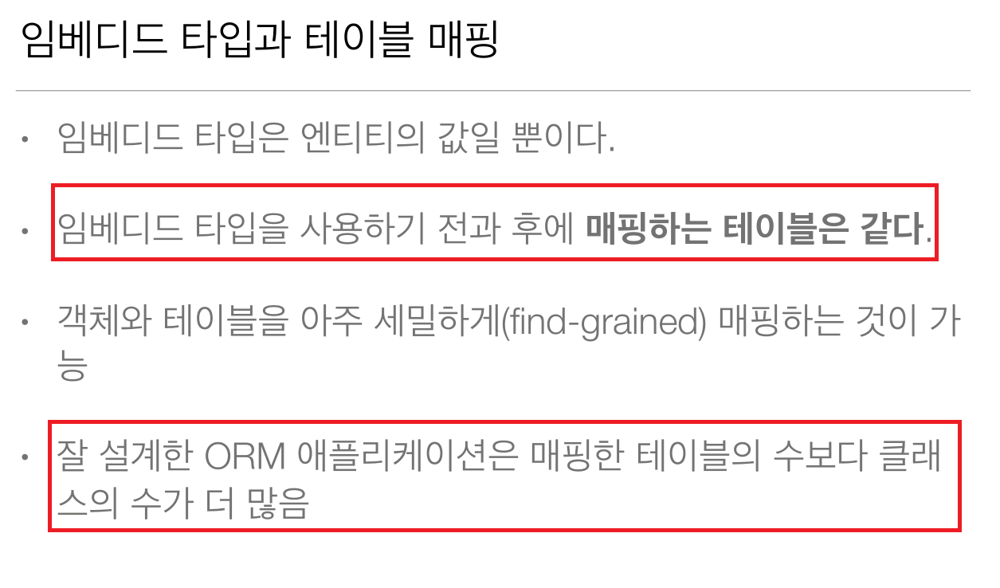  
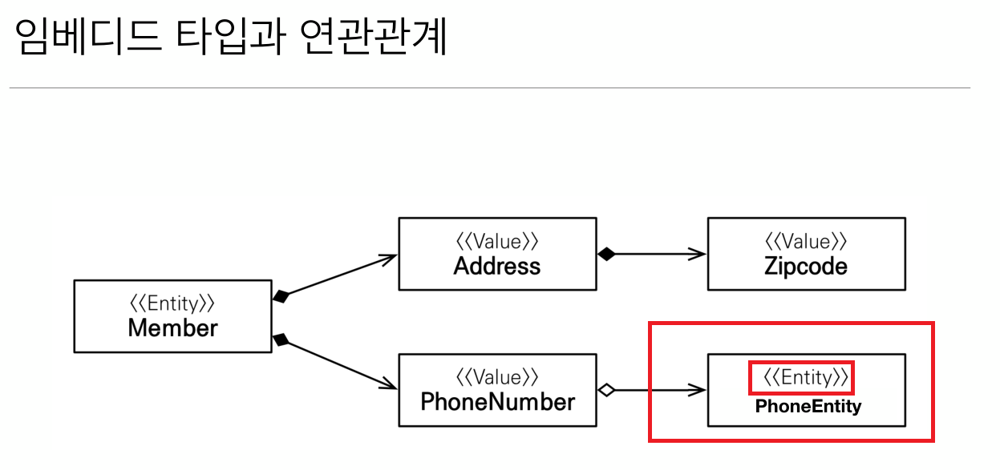  
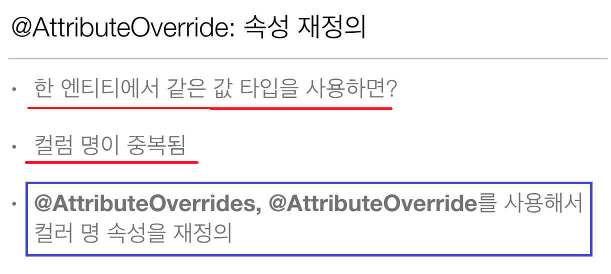  
  

**Address** 임베디드 타입

```java
/**
 * 임베디드 타입 정의 클래스에 설정
 */
@Embeddable
public class Address {
    private String city;
    private String street;
    private String zipcode;
    
    public Address() {} //기본 생성자 필수
    
    public Address(String city, String street, String zipcode) {
        this.city = city;
        this.street = street;
        this.zipcode = zipcode;
    }


    public String getCity() {
        return city;
    }

    public void setCity(String city) {
        this.city = city;
    }

    public String getStreet() {
        return street;
    }

    public void setStreet(String street) {
        this.street = street;
    }

    public String getZipcode() {
        return zipcode;
    }

    public void setZipcode(String zipcode) {
        this.zipcode = zipcode;
    }
}
```

**Period** 임베디드 타입

```java
/**
 *  임베디드 타입 정의 클래스에 설정
 */
@Embeddable
public class Period {
    private LocalDateTime startDate;
    private LocalDateTime endDate;
    
    public Period() {} //기본 생성자 필수
    
    public Period(LocalDateTime startDate, LocalDateTime endDate) {
        this.startDate = startDate;
        this.endDate = endDate;
    }

    public LocalDateTime getStartDate() {
        return startDate;
    }

    public void setStartDate(LocalDateTime startDate) {
        this.startDate = startDate;
    }

    public LocalDateTime getEndDate() {
        return endDate;
    }

    public void setEndDate(LocalDateTime endDate) {
        this.endDate = endDate;
    }
}
```

**Member** 엔티티

```java
@Entity
public class Member {
    
    @Id @GeneratedValue
    private Long id;
    private String name;
    
    /**
     * 임베디드 타입 사용 필드에 설정
     */
    @Embedded 
    private Period  period;
    
    /** 
     * 같은 타입이 중복되어 사용될 경우 실제 테이블 매핑 컬럼과 어떻게 매칭될 껀지를 결정해야됨
     */
    @Embedded
    @AttributeOverrides(value = {
            @AttributeOverride(name = "city", column = @Column(name = "HOME_CITY")),
            @AttributeOverride(name = "street", column = @Column(name = "HOME_STREET")),
            @AttributeOverride(name = "zipcode", column = @Column(name = "HOME_ZIPCODE"))})
    private Address homeAddress;
    
    @Embedded
    @AttributeOverrides(value = {
            @AttributeOverride(name = "city", column = @Column(name = "WORK_CITY")),
            @AttributeOverride(name = "street", column = @Column(name = "WORK_STREET")),
            @AttributeOverride(name = "zipcode", column = @Column(name = "WORK_ZIPCODE"))})
    private Address workAddress;

    public Long getId() {
        return id;
    }

    public void setId(Long id) {
        this.id = id;
    }

    public String getName() {
        return name;
    }

    public void setName(String name) {
        this.name = name;
    }

    public Period getPeriod() {
        return period;
    }

    public void setPeriod(Period period) {
        this.period = period;
    }

    public Address getHomeAddress() {
        return homeAddress;
    }

    public void setHomeAddress(Address homeAddress) {
        this.homeAddress = homeAddress;
    }

    public Address getWorkAddress() {
        return workAddress;
    }

    public void setWorkAddress(Address workAddress) {
        this.workAddress = workAddress;
    }
    
}
```

## 실행
```java
public class JPAMain {

    public static void main(String[] args) {
        
        EntityManagerFactory emf = Persistence.createEntityManagerFactory("H2");
        
        
        //트랜잭션당 하나씩 생성
        EntityManager em = emf.createEntityManager();
        EntityTransaction tx = em.getTransaction();
        try {
            tx.begin(); // 트랜잭션시작
            Member member = new Member();
            member.setName("HELLO");
            member.setHomeAddress(new Address("seoul", "AAA", "12312"));
            member.setWorkAddress(new Address("daejeon", "BBB", "12312"));
            member.setPeriod(new Period(LocalDateTime.now(), LocalDateTime.now()));
            
            em.persist(member);
      
            tx.commit();
        } catch (Exception e) {
            e.printStackTrace();
            tx.rollback();
        } finally {
            em.close();
        }
        emf.close();
    }
}
```

생성된 Member 테이블의 구조  
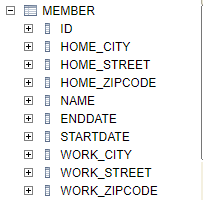  
