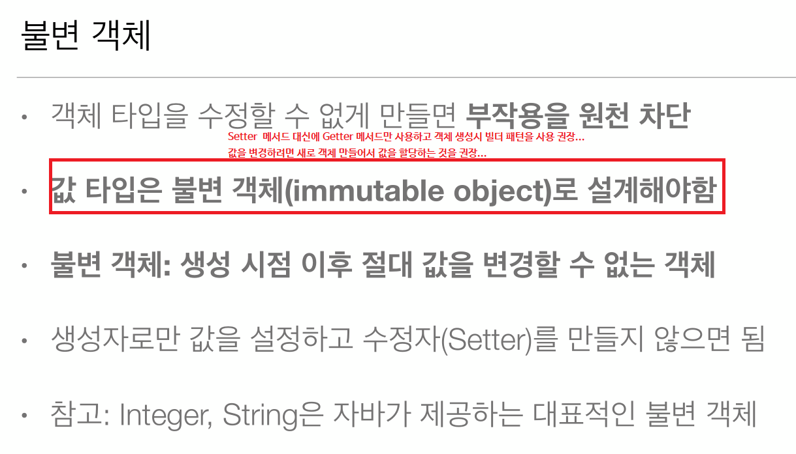

# 10. 값 타입과 불변 객체  

  
  
  
  
  
  
  

## 임베디드 타입 객체의 공유 위험 회피하기

**Address** 임베디드 타입
```java

@Embeddable //임베디드 타입 정의 클래스에 설정
public class Address implements Cloneable {
    private String city;
    private String street;
    private String zipcode;
    
    public Address() {} //기본 생성자 필수
    
    public Address(String city, String street, String zipcode) {
        this.city = city;
        this.street = street;
        this.zipcode = zipcode;
    }


    public String getCity() {
        return city;
    }

    private void setCity(String city) {
        this.city = city;
    }

    public String getStreet() {
        return street;
    }

    private void setStreet(String street) {
        this.street = street;
    }

    public String getZipcode() {
        return zipcode;
    }

    private void setZipcode(String zipcode) {
        this.zipcode = zipcode;
    }

    @Override
    public Address clone() throws CloneNotSupportedException {
        Address clone = (Address) super.clone();
        clone.setCity(this.city);
        clone.setStreet(this.street);
        clone.setZipcode(this.zipcode);
        return clone;
    }
}
```

## 실행 
```java
public class JPAMain {

    public static void main(String[] args) {
        
        EntityManagerFactory emf = Persistence.createEntityManagerFactory("H2");
        
        
        //트랜잭션당 하나씩 생성
        EntityManager em = emf.createEntityManager();
        EntityTransaction tx = em.getTransaction();
        try {
            tx.begin(); // 트랜잭션시작
            
            /**
             * 1. 같은 객체를 사용할꺼면 clone을 이용해서 각각의 객체에 세팅할 것
             * 2. 같은 객체를 참조하는 경우 중간에 값을 못바꾸게 set메서드 다 제거하거나 접근제한자 private으로 변경 //추천
             * 3. 정말로 수정이 필요한 경우 같은 값을 가지는 각각의 객체를 생성해서 설정한다.
             * 왜냐하면 같은 객체를 참조시 값이 바뀌는 경우 모두다 영향을 줄수 있음 
             * 공유참조로 인한 부작용을 피하자!
             */
            Address address = new Address("seoul", "AAA", "12312");
            Member member = new Member();
            member.setName("HELLO");
            
            member.setHomeAddress(address);
            member.setWorkAddress(address.clone()); //clone을 이용한 값 설정
            member.setPeriod(new Period(LocalDateTime.now(), LocalDateTime.now()));
            
            em.persist(member);
      
            tx.commit();
        } catch (Exception e) {
            e.printStackTrace();
            tx.rollback();
        } finally {
            em.close();
        }
        emf.close();
    }
}
```