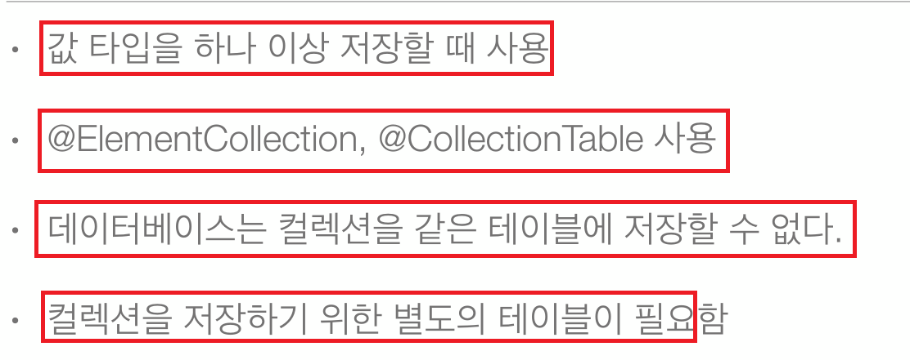

# 12. 값 타입 컬렉션 및 값 타입 매핑

  
  
  
  
  
  
  
  

## 예제

**Address** 임베디드 값 타입

```java
@Embeddable 
public class Address  {
    private String city;
    private String street;
    private String zipcode;
    
    public Address() {} 
    
    public Address(String city, String street, String zipcode) {
        this.city = city;
        this.street = street;
        this.zipcode = zipcode;
    }

    public String getCity() {
        return city;
    }

    public String getStreet() {
        return street;
    }

    public String getZipcode() {
        return zipcode;
    }

    @Override
    public int hashCode() {
        final int prime = 31;
        int result = 1;
        result = prime * result + ((getCity() == null) ? 0 : getCity().hashCode());
        result = prime * result + ((getStreet() == null) ? 0 : getStreet().hashCode());
        result = prime * result + ((getZipcode() == null) ? 0 : getZipcode().hashCode());
        return result;
    }

    @Override
    public boolean equals(Object obj) {
        if (this == obj)
            return true;
        if (obj == null)
            return false;
        if (getClass() != obj.getClass())
            return false;
        Address other = (Address) obj;
        if (getCity() == null) {
            if (other.getCity() != null)
                return false;
        } else if (!getCity().equals(other.getCity()))
            return false;
        if (getStreet() == null) {
            if (other.getStreet() != null)
                return false;
        } else if (!getStreet().equals(other.getStreet()))
            return false;
        if (getZipcode() == null) {
            if (other.getZipcode() != null)
                return false;
        } else if (!getZipcode().equals(other.getZipcode()))
            return false;
        return true;
    }
}
```

**Period** 임베디드 값 타입
```java
@Embeddable 
public class Period {
    private LocalDateTime startDate;
    private LocalDateTime endDate;
    
    public Period() {} 
    
    public Period(LocalDateTime startDate, LocalDateTime endDate) {
        this.startDate = startDate;
        this.endDate = endDate;
    }

    public LocalDateTime getStartDate() {
        return startDate;
    }

    public LocalDateTime getEndDate() {
        return endDate;
    }

    @Override
    public int hashCode() {
        final int prime = 31;
        int result = 1;
        result = prime * result + ((getEndDate() == null) ? 0 : endDate.hashCode());
        result = prime * result + ((getStartDate() == null) ? 0 : startDate.hashCode());
        return result;
    }

    @Override
    public boolean equals(Object obj) {
        if (this == obj)
            return true;
        if (obj == null)
            return false;
        if (getClass() != obj.getClass())
            return false;
        Period other = (Period) obj;
        if (getEndDate() == null) {
            if (other.getEndDate() != null)
                return false;
        } else if (!getEndDate().equals(other.getEndDate()))
            return false;
        if (getStartDate() == null) {
            if (other.getStartDate() != null)
                return false;
        } else if (!getStartDate().equals(other.getStartDate()))
            return false;
        return true;
    }
}
```

**Member** 엔티티 

```java
@Entity
public class Member {
    
    @Id @GeneratedValue
    @Column(name = "MEMBER_ID")
    private Long id;
    private String name;
    
    @Embedded 
    private Period  period;
    
    @Embedded
    private Address homeAddress;
    
    // ElementCollection - 기본은 지연로딩
    @ElementCollection 
    @CollectionTable(name = "FAVORITE_FOOD", 
                     joinColumns = {@JoinColumn(name = "MEMBER_ID")}) // joinColumns는 값 타입 테이블에서 조인에 사용되는 컬럼(외래키 걸린 컬럼)
    @Column(name = "FOOD_NAME") // 예외적으로 FAVORITE_FOOD에 FOOD_NAME 컬럼 생성 - 값이 String 타입 하나이기 때문에
    private Set<String> favoriteFoods = new HashSet<>();
    
    // ElementCollection - 기본은 지연로딩
    @ElementCollection
    @CollectionTable(name = "ADDRESS", joinColumns = {@JoinColumn(name = "MEMBER_ID")})
    private List<Address> addressHistoryAddresses = new ArrayList<>();
    
    public Set<String> getFavoriteFoods() {
        return favoriteFoods;
    }

    public List<Address> getAddressHistoryAddresses() {
        return addressHistoryAddresses;
    }
    
    public Long getId() {
        return id;
    }

    public void setId(Long id) {
        this.id = id;
    }

    public String getName() {
        return name;
    }

    public void setName(String name) {
        this.name = name;
    }

    public Period getPeriod() {
        return period;
    }

    public void setPeriod(Period period) {
        this.period = period;
    }

    public Address getHomeAddress() {
        return homeAddress;
    }

    public void setHomeAddress(Address homeAddress) {
        this.homeAddress = homeAddress;
    }
}
```

## 실행

```java
public class JPAMain {

    public static void main(String[] args) {
        
        EntityManagerFactory emf = Persistence.createEntityManagerFactory("H2");
        
        
        //트랜잭션당 하나씩 생성
        EntityManager em = emf.createEntityManager();
        EntityTransaction tx = em.getTransaction();
        try {
            tx.begin(); // 트랜잭션시작
            Member member = new Member();
            member.setName("member1");
            member.setHomeAddress(new Address("homeCity", "street", "zipcode"));
            
            member.getFavoriteFoods().add("치킨");
            member.getFavoriteFoods().add("족발");
            member.getFavoriteFoods().add("피자");
            
            member.getAddressHistoryAddresses().add(new Address("old1", "street", "zipcode"));
            member.getAddressHistoryAddresses().add(new Address("old2", "street", "zipcode"));
            em.persist(member);
            em.flush();
            em.clear();
            
            Member findMember = em.find(Member.class, member.getId());
            
            Address oldAddress = findMember.getHomeAddress();
            
            // 값 타입은 새객체로 교체해주어야 한다.
            findMember.setHomeAddress(new Address("newcity", oldAddress.getStreet(), oldAddress.getZipcode()));
            
            // 값 타입 컬렉션도 immutable 해야하기 때문에 값을 변경하고 있으면 다음과 같이 해야한다.
            findMember.getFavoriteFoods().remove("치킨");
            findMember.getFavoriteFoods().add("한식");
            
            // 값 타입 컬렉션도 immutable 해야하기 때문에 값을 변경하고 있으면 다음과 같이 해야한다.
            // equals를 잘 구현되어 있어야됨
            findMember.getAddressHistoryAddresses().remove(new Address("old1", "street", "zipcode"));
            findMember.getAddressHistoryAddresses().add(new Address("newCity1", "street", "zipcode"));
            
            tx.commit();
        } catch (Exception e) {
            e.printStackTrace();
            tx.rollback();
        } finally {
            em.close();
        }
        emf.close();
    }
}
```