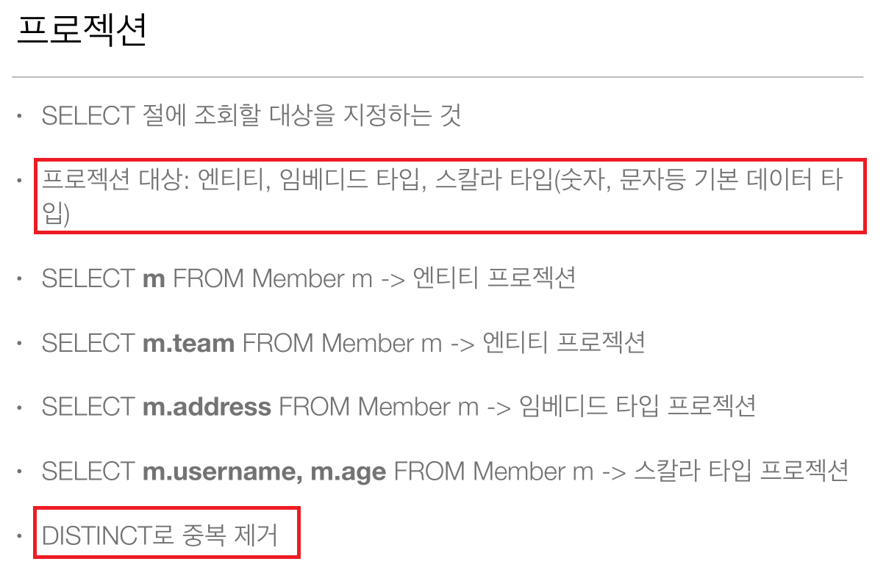
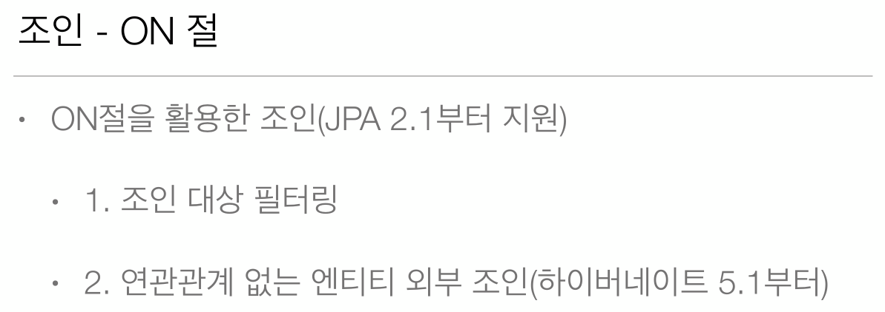
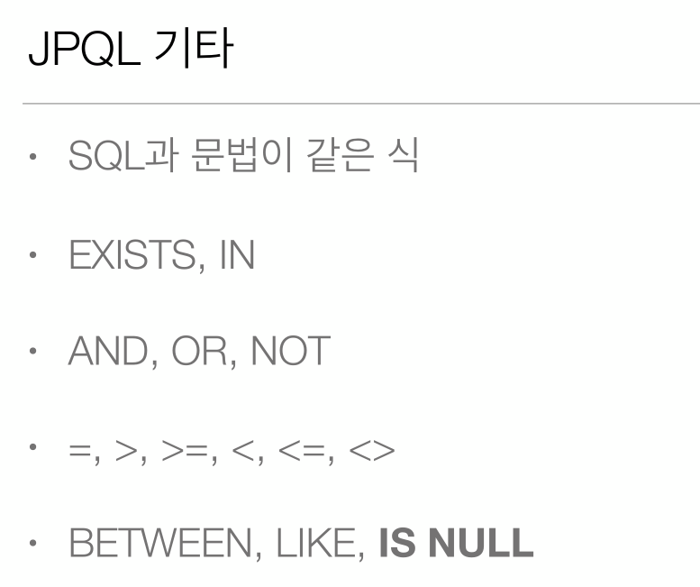
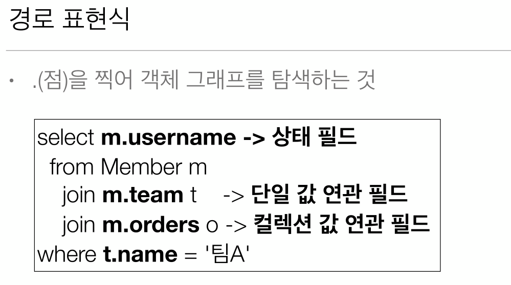
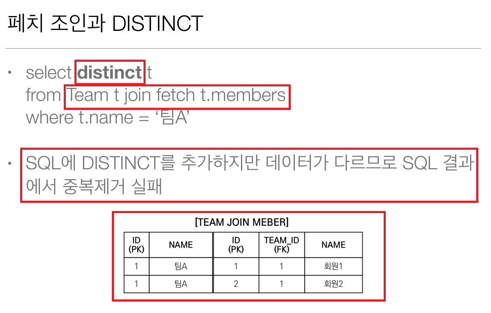
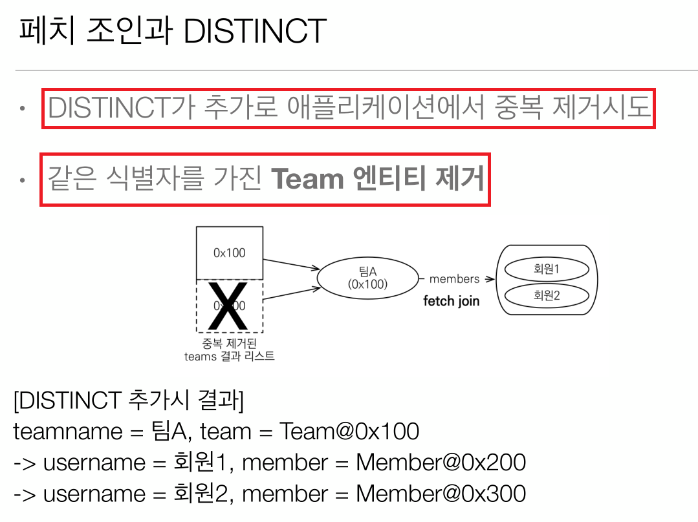

# 13. JPQL 객체 지향 쿼리 언어

  
  
  
  
  
  
  
  
  
  
  
  
  
  
  
  
  
  
  
  
  
  
  
  
  
  
  
  
  
  
  
  
  
  
  
  
  
  
  
  
  
  
  
  
  
  
  
  
  
  
  
  
  
  
  
  
  
  
  
  
  
  
  
  
  
  
  
  
  
  
  
  
  
  

## N + 1 문제 해결을 위한 설정
fetch 조인을 사용하지 않고 Lazy로딩으로 설정된 일대다 양방향 매핑을 리스트를 가져올 때
사용할때 최적하 하는 방법이다.  
  
값을 설정 함으로써 실제 IN 쿼리를 이용하여 값만큼 메모리에 미리 로드 시켜 놓기 때문에  
DB에 쿼리를 던지는 횟수가 줄어든다.  

**설정 방법**
- 엔티티 매핑 리스트에 `@BatchSize`를 이용한 로컬 세팅 
```java
    @BatchSize(size = 100)
    @OneToMany(mappedBy = "team")
    private List<Member> members = new ArrayList<>();
```
- `persistence.xml`에 글로벌 세팅하기

```xml
<?xml version="1.0" encoding="UTF-8"?>
<persistence version="2.2" 
    xmlns="http://xmlns.jcp.org/xml/ns/persistence"
	xmlns:xsi="http://www.w3.org/2001/XMLSchema-instance"
	xsi:schemaLocation="http://xmlns.jcp.org/xml/ns/persistence http://xmlns.jcp.org/xml/ns/persistence/persistence_2_2.xsd">

	<persistence-unit name="H2">
	
	    <!-- import할 NamedQuery가 설정된 xml 파일 경로 지정 -->
	    <mapping-file>META-INF/ormMember.xml</mapping-file>
	    <mapping-file>META-INF/ormTeam.xml</mapping-file>
	    
		<properties>
			<property name="javax.persistence.jdbc.driver" value="org.h2.Driver" />
			<property name="javax.persistence.jdbc.url" value="jdbc:h2:tcp://localhost/~/test" />
			<property name="javax.persistence.jdbc.user" value="sa" />
			<property name="javax.persistence.jdbc.password" value="" />
			
			<!-- 하이버네이트 방언 설정 -->
			<property name="hibernate.dialect" value="com.jpa.study.dialect.CustomH2Dialect" />
			
			<property name="hibernate.show_sql" value="true" />
			<property name="hibernate.format_sql" value="true"/>
			<property name="hibernate.use_sql_comments" value="true"/>

			<property name="hibernate.hbm2ddl.auto" value="create" />
			
			<!-- @BatchSize의 글로벌 세팅 -->
			<property name="hibernate.default_batch_fetch_size" value="100"/>

		</properties>

	</persistence-unit>
</persistence>
```